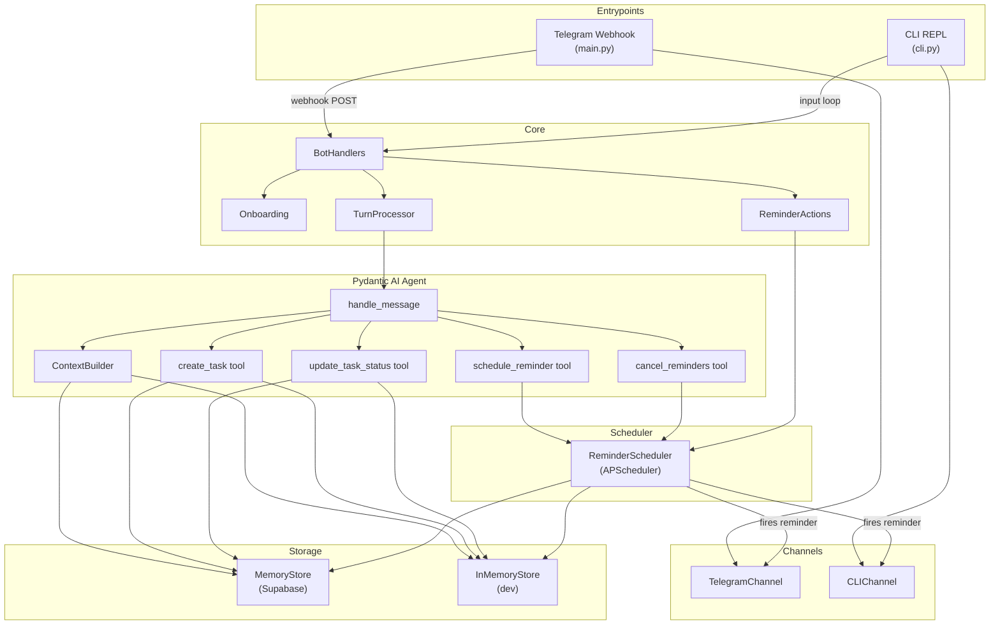

# Architecture

## Repository Structure

```
amigo/
├── src/                    # Application source code
│   ├── main.py             # FastAPI app, Telegram webhook, lifecycle
│   ├── cli.py              # CLI entrypoint for local dev (no Telegram)
│   ├── config.py           # Pydantic Settings from .env
│   ├── __main__.py         # python -m src.cli module entrypoint
│   ├── agent/              # Pydantic AI agent with tool-calling loop
│   │                       #   (ADR 0002: single turn, native tools)
│   ├── bot/                # Telegram adapter: handlers, onboarding,
│   │                       #   turns, reminder callbacks, keyboards
│   ├── channels/           # MessageChannel protocol + implementations
│   │                       #   (Telegram, CLI)
│   ├── providers/          # (deprecated — model handling by pydantic-ai)
│   ├── memory/             # Supabase store, in-memory store, sessions,
│   │                       #   context assembly
│   ├── scheduler/          # APScheduler reminder management + reload
│   ├── tools/              # Side-effect tools: create task, update status,
│   │                       #   schedule/cancel reminders
│   ├── utils/              # Clock, timezone helpers
│   └── db/                 # Supabase client singleton
├── tests/                  # Pytest test suite (all unit, no network)
│   └── fakes.py            # Shared in-memory fakes for all test modules
├── scripts/                # Utility scripts
│   └── smoke_check.py      # Production liveness checks (scheduler + channel)
├── migrations/             # Supabase SQL schema migrations
├── docs/                   # Design docs, architecture, and ADRs
│   └── adr/                # Architecture Decision Records
├── pyproject.toml          # Project metadata, dependencies, tool config
├── .env.example            # Environment variable template
└── README.md               # User-facing documentation
```

## Key Modules

- `src/agent/` — Pydantic AI agent with native tool-calling loop
  (see [ADR 0002](adr/0002-agentic-tool-calling-loop.md)). A single
  `Agent` object handles the entire user turn: the model sees the
  message, decides which tools to call, observes results, and produces
  a reply. Tools execute side effects through injected services.
  `AgentDeps` carries per-request context (store, scheduler, user).
- `src/bot/` — Telegram-specific glue. `BotHandlers` routes messages
  through allowlist → onboarding → turn processing.
- `src/channels/` — `MessageChannel` Protocol with `TelegramChannel` and
  `CLIChannel` implementations. All bot code depends on the protocol, never
  on a concrete channel.
- `src/memory/` — `MemoryStore` (Supabase CRUD), `InMemoryStore`
  (dict-backed dev replacement), `SessionManager`, `ContextBuilder`.
- `src/scheduler/` — `ReminderScheduler` wraps APScheduler with stable
  job IDs, snooze policy, and restart-safe reload from database.
- `src/tools/` — Side-effect service classes. Called by agent tools and
  `ReminderActions` callback handlers. `CreateTaskTool`,
  `UpdateTaskStatusTool`, `ScheduleReminderTool`, `CancelRemindersTool`.

## Patterns

- **Protocol-based abstraction**: `MessageChannel` is a `typing.Protocol`
  class. Implementations are swappable without touching consumer code.
- **Dependency injection**: Per-request state flows through `AgentDeps`
  dataclass. Major classes accept dependencies in `__init__`.
- **Async everywhere**: All store, channel, and agent methods are
  `async def`, even when the underlying call is synchronous (Supabase
  client is sync but wrapped for interface consistency).
- **UTC internally, user-tz at boundaries**: All timestamps stored as
  naive UTC. Conversion to user timezone happens only at display/logic
  boundaries via `src/utils/`.
- **Agentic tool calling**: The LLM decides which tools to call based on
  function signatures and docstrings. No more manual classify → extract →
  resolve pipeline. See [ADR 0002](adr/0002-agentic-tool-calling-loop.md).
- **Deterministic time resolution**: `dateparser` handles "3pm", "in 10
  minutes", "after lunch" → UTC datetime conversion without an LLM call.

## Data Flow (message lifecycle)



1. **Inbound**: Telegram webhook (or CLI input) delivers text + chat_id.
2. **Routing**: `BotHandlers` checks allowlist → onboarding status →
   delegates to `TurnProcessor`.
3. **Turn processing**: `TurnProcessor` builds `AgentDeps` with per-request
   context (user, session, timezone) and calls `handle_message`.
4. **Agent**: `handle_message` stores the user message, builds context
   via `ContextBuilder`, runs the Pydantic AI agent. The agent decides
   which tools to call (create task, update status, schedule reminder)
   and produces a natural language reply.
5. **Outbound**: Response sent via `MessageChannel.send_message()`.
6. **Reminders**: Reminder tools use `dateparser` for time resolution and
   schedule APScheduler jobs. When a job fires, it sends a message with
   Done/Skip/Later buttons. Callbacks handled by `ReminderActions`.

## Key Abstractions

| Abstraction | Location | Purpose |
|-------------|----------|---------|
| `MessageChannel` | `channels/base.py` | Protocol for sending messages (Telegram, CLI) |
| `AgentDeps` | `agent/agent.py` | Per-request dependency injection for agent tools |
| Store (duck-typed) | `memory/store.py` | `MemoryStore`, `InMemoryStore` |
| `amigo_agent` | `agent/agent.py` | Pydantic AI Agent with registered tools |

## Extensibility

### Adding a new channel

1. Create `src/channels/your_channel.py` implementing `MessageChannel`.
2. Wire it in a new entrypoint or add a branch in `main.py`.
3. No changes needed in `bot/`, `agent/`, or `scheduler/`.

### Adding a new LLM provider

Pydantic AI supports many providers natively. Change `DEFAULT_MODEL` in
`.env` to any supported model string (e.g., `openai:gpt-4o`,
`anthropic:claude-sonnet-4-20250514`). No code changes needed.

### Adding a new store backend

1. Implement every method from `MemoryStore` (duck-typed, no base
   class to inherit from).
2. Mirror changes in `InMemoryStore` and `tests/fakes.py:FakeStore`.

### Adding a new tool

1. Add a function decorated with `@amigo_agent.tool` in `src/agent/agent.py`.
2. The function receives `RunContext[AgentDeps]` for access to store,
   scheduler, user, etc. Docstring becomes the tool description for the LLM.

## Testing

- **Framework**: pytest + pytest-asyncio (auto mode).
- **Agent testing**: Pydantic AI's `TestModel` replaces the LLM in tests.
  Use `amigo_agent.override(model=TestModel())` to run deterministic tests.
- **Fakes**: External dependencies replaced with in-memory fakes from
  `tests/fakes.py` — `FakeChannel`, `FakeStore`, `FakeScheduler`.
  No network calls, no database.
- **Clock injection**: `SessionManager` and `ReminderScheduler` accept
  a `Clock` instance, allowing deterministic time in tests.

| Test file | What it covers |
|-----------|---------------|
| `test_agent_planning.py` | Agent handle_message, tool execution, error handling |
| `test_allowlist.py` | Chat ID allowlist enforcement |
| `test_channels.py` | CLI and Telegram channel adapter behavior |
| `test_onboarding.py` | Multi-step onboarding state machine |
| `test_reminders.py` | Snooze escalation policy |
| `test_scheduler.py` | Scheduler job registration, cancel, reload, send |
| `test_session_boundaries.py` | Close signals, session type classification |
| `test_session_rollover.py` | Midnight boundary, inactivity timeout |
| `test_timezone.py` | UTC↔local conversion, date boundaries |
| `test_tools.py` | Individual tool service class behavior |
| `test_turn_processing.py` | End-to-end turn processing with TestModel |

### Smoke Checks

[`scripts/smoke_check.py`](../scripts/smoke_check.py) provides
production-liveness verification:

- `--scheduler` — in-memory APScheduler fires through a recording channel
- `--channel` — sends a real Telegram ping (requires `TELEGRAM_BOT_TOKEN`
  and `SMOKE_TEST_CHAT_ID`)
- `--all` — runs both checks

No Supabase writes. Safe for CI/CD.

## Further Reading

- [README.md](../README.md) — User-facing setup and usage guide.
- [ADR 0001](adr/0001-separate-bot-agent-tools.md) — Original Bot/Agent/Tools
  separation decision (superseded by ADR 0002).
- [ADR 0002](adr/0002-agentic-tool-calling-loop.md) — Agentic tool-calling
  loop replacing the classify→extract→resolve pipeline.
- [implementation_plan.md](../implementation_plan.md) — Full Phase 1a
  design document with rationale and decisions.
- [what-is-amigo.md](what-is-amigo.md) — Product vision and positioning.
- [comparison_with_OpenHuman.md](comparison_with_OpenHuman.md) —
  Competitive analysis.
- [amigo_system_architecture.svg](amigo_system_architecture.svg) —
  Visual architecture diagram.
- [migrations/001_initial_schema.sql](../migrations/001_initial_schema.sql)
  — Database schema and table definitions.
