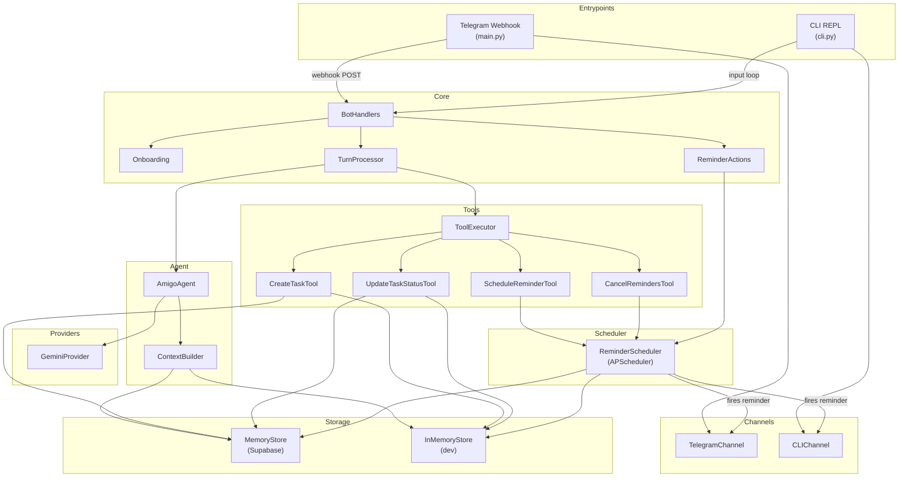

# Architecture

## Repository Structure

```
amigo/
├── src/                    # Application source code
│   ├── main.py             # FastAPI app, Telegram webhook, lifecycle
│   ├── cli.py              # CLI entrypoint for local dev (no Telegram)
│   ├── config.py           # Pydantic Settings from .env
│   ├── __main__.py         # python -m src.cli module entrypoint
│   ├── agent/              # LLM orchestration: planning, task extraction,
│   │                       #   status detection, conversation, models
│   ├── bot/                # Telegram adapter: handlers, onboarding,
│   │                       #   turns, reminder callbacks, keyboards
│   ├── channels/           # MessageChannel protocol + implementations
│   │                       #   (Telegram, CLI)
│   ├── providers/          # ModelProvider protocol + Gemini implementation
│   ├── memory/             # Supabase store, in-memory store, sessions,
│   │                       #   context assembly
│   ├── scheduler/          # APScheduler reminder management + reload
│   ├── tools/              # Side-effect tools: create task, update status,
│   │                       #   schedule/cancel reminders, tool executor
│   ├── utils/              # Clock, timezone helpers
│   └── db/                 # Supabase client singleton
├── tests/                  # Pytest test suite (all unit, no network)
│   └── fakes.py            # Shared in-memory fakes for all test modules
├── scripts/                # Utility scripts
│   └── smoke_check.py      # Production liveness checks (scheduler + channel)
├── migrations/             # Supabase SQL schema migrations
├── docs/                   # Design docs, architecture, and ADRs
│   └── adr/                # Architecture Decision Records
├── pyproject.toml          # Project metadata, dependencies, tool config
├── .env.example            # Environment variable template
└── README.md               # User-facing documentation
```

## Key Modules

- `src/agent/` — Core AI logic. `AmigoAgent` orchestrates chat, morning
  planning, task extraction, and status updates. Returns structured
  `AgentDecision`s with tool calls — never executes side effects directly.
  Includes `models.py` (Pydantic schemas for LLM output) and
  `task_matching.py` (fuzzy title matching).
- `src/bot/` — Telegram-specific glue. `BotHandlers` routes messages
  through allowlist → onboarding → turn processing.
- `src/channels/` — `MessageChannel` Protocol with `TelegramChannel` and
  `CLIChannel` implementations. All bot code depends on the protocol, never
  on a concrete channel.
- `src/providers/` — `ModelProvider` Protocol with `GeminiProvider`.
  Designed for future Claude/local model swaps.
- `src/memory/` — `MemoryStore` (Supabase CRUD), `InMemoryStore`
  (dict-backed dev replacement), `SessionManager`, `ContextBuilder`.
- `src/scheduler/` — `ReminderScheduler` wraps APScheduler with stable
  job IDs, snooze policy, and restart-safe reload from database.
- `src/tools/` — Side-effect executors. `ToolExecutor` runs tool calls
  from agent decisions. Individual tools: `CreateTaskTool`,
  `UpdateTaskStatusTool`, `ScheduleReminderTool`, `CancelRemindersTool`.
  See [ADR 0001](adr/0001-separate-bot-agent-tools.md).

## Patterns

- **Protocol-based abstraction**: `MessageChannel` and `ModelProvider`
  are `typing.Protocol` classes. Implementations are swappable without
  touching consumer code.
- **Dependency injection via constructor**: All major classes accept
  their dependencies in `__init__`, not via globals.
- **Async everywhere**: All store, channel, and agent methods are
  `async def`, even when the underlying call is synchronous (Supabase
  client is sync but wrapped for interface consistency).
- **UTC internally, user-tz at boundaries**: All timestamps stored as
  naive UTC. Conversion to user timezone happens only at display/logic
  boundaries via `src/utils/`.
- **Structured LLM output**: Task extraction and status detection use
  Pydantic models as `response_schema` for JSON-mode generation.

## Data Flow (message lifecycle)



1. **Inbound**: Telegram webhook (or CLI input) delivers text + chat_id.
2. **Routing**: `BotHandlers` checks allowlist → onboarding status →
   delegates to `TurnProcessor`.
3. **Turn processing**: `TurnProcessor` checks for status updates
   (e.g., "done with slides"), task lists, feedback commands, or
   falls through to general chat.
4. **Agent**: `AmigoAgent.chat()` stores the user message, builds
   context via `ContextBuilder` (profile + yesterday + tasks + session
   history), calls `GeminiProvider.generate()`, stores the response.
5. **Outbound**: Response sent via `MessageChannel.send_message()`.
6. **Reminders**: If tasks have reminder times, `ReminderActions`
   resolves the time via LLM, persists a reminder row, and schedules
   an APScheduler job. When it fires, it sends a message with
   Done/Skip/Later buttons.

## Key Abstractions

| Protocol | Location | Implementations |
|----------|----------|-----------------|
| `MessageChannel` | `channels/base.py` | `TelegramChannel`, `CLIChannel` |
| `ModelProvider` | `providers/base.py` | `GeminiProvider` |
| Store (duck-typed) | `memory/store.py` | `MemoryStore`, `InMemoryStore` |
| `ToolExecutor` | `tools/executor.py` | Runs `ToolCall`s from agent decisions |

## Extensibility

### Adding a new channel

1. Create `src/channels/your_channel.py` implementing `MessageChannel`.
2. Wire it in a new entrypoint or add a branch in `main.py`.
3. No changes needed in `bot/`, `agent/`, or `scheduler/`.

### Adding a new LLM provider

1. Create `src/providers/your_provider.py` implementing `ModelProvider`.
2. Pass it to `AmigoAgent(model=your_provider, store=store)`.

### Adding a new store backend

1. Implement every method from `MemoryStore` (duck-typed, no base
   class to inherit from).
2. Mirror changes in `InMemoryStore` and `tests/fakes.py:FakeStore`.

## Testing

- **Framework**: pytest + pytest-asyncio (auto mode).
- **Fakes**: All external dependencies are replaced with in-memory
  fakes from `tests/fakes.py` — `FakeChannel`, `FakeStore`,
  `FakeModel`, `FakeScheduler`. No network calls, no database.
- **Clock injection**: `SessionManager` and `ReminderScheduler` accept
  a `Clock` instance, allowing deterministic time in tests.

| Test file | What it covers |
|-----------|---------------|
| `test_agent_planning.py` | Agent decision/planning and tool call generation |
| `test_allowlist.py` | Chat ID allowlist enforcement |
| `test_channels.py` | CLI and Telegram channel adapter behavior |
| `test_onboarding.py` | Multi-step onboarding state machine |
| `test_reminders.py` | Snooze escalation policy |
| `test_scheduler.py` | Scheduler job registration, cancel, reload, send |
| `test_session_boundaries.py` | Close signals, session type classification |
| `test_session_rollover.py` | Midnight boundary, inactivity timeout |
| `test_task_extraction.py` | Pydantic model validation for extractions |
| `test_timezone.py` | UTC↔local conversion, date boundaries |
| `test_tools.py` | Tool executor and individual tool behavior |
| `test_turn_processing.py` | End-to-end turn processing with tools |

### Smoke Checks

[`scripts/smoke_check.py`](../scripts/smoke_check.py) provides
production-liveness verification:

- `--scheduler` — in-memory APScheduler fires through a recording channel
- `--channel` — sends a real Telegram ping (requires `TELEGRAM_BOT_TOKEN`
  and `SMOKE_TEST_CHAT_ID`)
- `--all` — runs both checks

No Supabase writes. Safe for CI/CD.

## Further Reading

- [README.md](../README.md) — User-facing setup and usage guide.
- [ADR 0001](adr/0001-separate-bot-agent-tools.md) — Bot/Agent/Tools
  separation decision.
- [implementation_plan.md](../implementation_plan.md) — Full Phase 1a
  design document with rationale and decisions.
- [what-is-amigo.md](what-is-amigo.md) — Product vision and positioning.
- [comparison_with_OpenHuman.md](comparison_with_OpenHuman.md) —
  Competitive analysis.
- [amigo_system_architecture.svg](amigo_system_architecture.svg) —
  Visual architecture diagram.
- [migrations/001_initial_schema.sql](../migrations/001_initial_schema.sql)
  — Database schema and table definitions.
