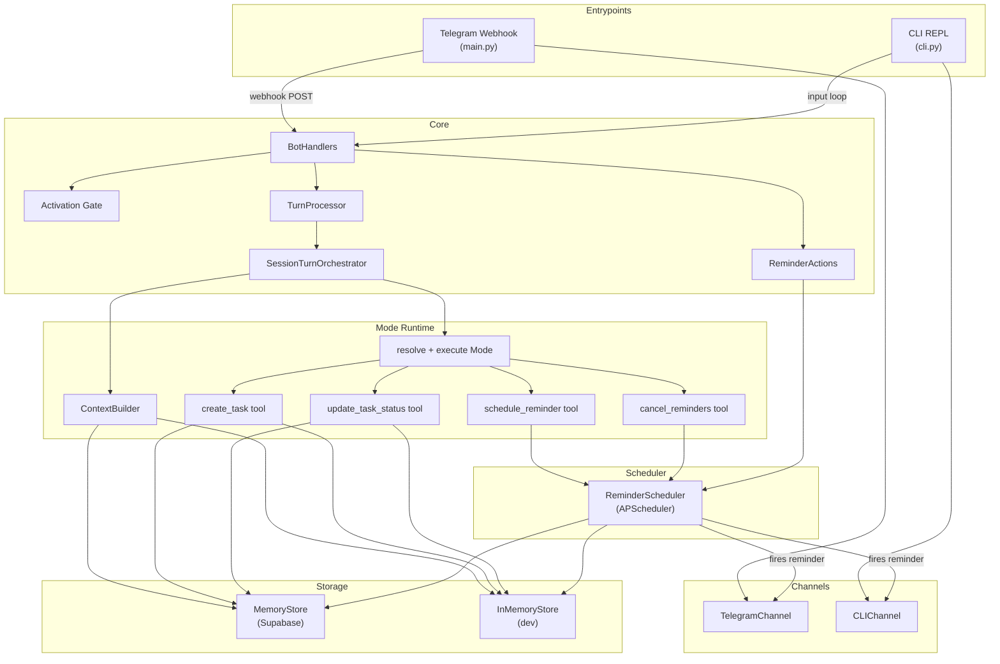

# Architecture

## Repository Structure

```
amigo/
├── src/                    # Application source code
│   ├── main.py             # FastAPI app, Telegram webhook, lifecycle
│   ├── cli.py              # CLI entrypoint for local dev (no Telegram)
│   ├── turns.py            # Session transcript + Mode execution orchestration
│   ├── config.py           # Pydantic Settings from .env
│   ├── __main__.py         # python -m src.cli module entrypoint
│   ├── agent/              # Pydantic AI agent with tool-calling loop
│   │                       #   (ADR 0002: single turn, native tools)
│   ├── activation.py       # Durable dashboard-first Activation read-model rules
│   ├── startup.py          # Schema gate before scheduler/webhook side effects
│   ├── bot/                # Telegram adapter: pairing gate, turns,
│   │                       #   reminder callbacks, keyboards
│   ├── channels/           # MessageChannel protocol + implementations
│   │                       #   (Telegram, CLI)
│   ├── memory/             # Supabase store, in-memory store, sessions,
│   │                       #   context fragments
│   ├── scheduler/          # APScheduler reminder management + reload
│   ├── tools/              # Side-effect tools: create task, update status,
│   │                       #   schedule/cancel reminders
│   ├── utils/              # Clock, timezone helpers
│   └── db/                 # Supabase client singleton
├── tests/                  # Pytest test suite (all unit, no network)
│   └── fakes.py            # Shared in-memory fakes for all test modules
├── scripts/                # Utility scripts
│   └── smoke_check.py      # Production liveness checks (scheduler + channel)
├── migrations/             # Supabase SQL schema migrations
├── docs/                   # Design docs, architecture, and ADRs
│   └── adr/                # Architecture Decision Records
├── pyproject.toml          # Project metadata, dependencies, tool config
├── .env.example            # Environment variable template
└── README.md               # User-facing documentation
```

## Key Modules

- `src/agent/` — Modes, with no direct side effects. Each Mode is a declared `ModeDefinition`
  (instructions, Toolsets, Turn Context providers, entitlement, model, handoffs, evaluation suite)
  registered in `catalogue.py`. `ModeRuntime` is the one entry point that runs a Turn in any Mode:
  it resolves and authorizes the Mode before anything is written, prepends the Safety Core to any
  Mode that does not state it, runs Pydantic AI's native tool-calling loop with only that Mode's
  Toolsets (see [ADR 0002](adr/0002-agentic-tool-calling-loop.md)). Routing and entitlement are
  replaceable async policies. Daily is live; Coach, Reflect, and Recommender are registered as
  planned and refused.
- `src/turns.py` — Application boundary around `ModeRuntime`. `SessionTurnOrchestrator` resolves
  the Mode before any write, loads and persists Session Messages, and maps model failures to the
  friendly participant reply. The model framework remains behind the runtime's owned result and
  history types; this layer does not import it.
- `src/bot/` — Telegram-specific glue. `BotHandlers` routes Pairing deep links first, permits
  Reminder callbacks needed by the Activation test, and requires canonical Activation completion
  before ordinary text reaches Turn processing. Legacy Telegram-only onboarding is unreachable.
- `src/channels/` — `MessageChannel` Protocol with `TelegramChannel` and
  `CLIChannel` implementations. All bot code depends on the protocol, never
  on a concrete channel.
- `src/memory/` — `MemoryStore` (Supabase CRUD), `InMemoryStore`
  (dict-backed dev replacement), `SessionManager`, `ContextBuilder`. Production Store and Auth
  paths use Supabase's native asynchronous client; each Store operation emits content-free
  outcome and duration evidence for staging/load analysis. A runtime monitor separately samples
  event-loop scheduling delay.
- `src/scheduler/` — `ReminderScheduler` treats database Reminders as authority and APScheduler as
  a rebuildable projection. Stable jobs, durable outbox effects, startup/periodic reconciliation,
  bounded poison retries, inverse-drift removal, and the 15-minute late policy converge after
  restart or scheduler failure. Each delivery uses an atomic claim and immutable attempt outcome;
  reconciliation records a scheduler heartbeat and content-free drift counts. Later uses the
  shared immutable replacement command.
- `src/tools/` — Every side effect. `toolsets.py` groups the model-callable Tools into reusable
  `TASKS` and `REMINDERS` Toolsets; `ToolContext` carries the per-Turn dependencies they receive.
  The Tool classes (`CreateTaskTool`, `UpdateTaskStatusTool`, `ScheduleReminderTool`,
  `CancelRemindersTool`) also serve the `ReminderActions` button callbacks.

## Patterns

- **Protocol-based abstraction**: `MessageChannel` is a `typing.Protocol`
  class. Implementations are swappable without touching consumer code.
- **Dependency injection**: Per-Turn state flows through the `ToolContext`
  dataclass. Major classes accept dependencies in `__init__`.
- **Async everywhere**: All store, channel, and agent methods are
  `async def`. Supabase network operations use its native `AsyncClient` and are explicitly
  awaited, so concurrent Turns and due Reminders yield to the event loop. Constructors and
  dataclass validation remain synchronous Python protocols; `ModeRegistry.__getitem__` and
  `__iter__` are the deliberate synchronous magic-method exceptions used by import-time catalogue
  construction and synchronous Gate A schema capture. All ordinary Mode policy, registry,
  runtime, and Turn-orchestrator methods are asynchronous.
- **Fail-closed startup**: The Supabase Store must report the exact application schema version
  (currently 16) before the scheduler, durable-outbox drain, Reminder reload, or Telegram webhook
  starts.
- **Dormant Mode authority schema**: migrations 015–016 order crossed Pairing locks and add
  Session-active-Mode, trial-grant, immutable grant-event, and confirmed-handoff primitives. The
  schema is adopted, but participant-facing switching remains unavailable until its Store, policy,
  command, Tool, and callback application slice is implemented and reviewed.
- **Canonical Activation**: Normal dashboard APIs and Telegram Turns remain locked until durable
  acknowledgement, Pairing, validated profile, actual test-Reminder delivery, and Telegram
  Done/Skip/Later evidence produce a completed Activation state. The dashboard snapshot embeds
  that same state.
- **UTC internally, user-tz at boundaries**: Database instants use timezone-aware PostgreSQL
  `TIMESTAMPTZ` values normalized to UTC. Conversion to a participant's timezone happens only at
  display and planning boundaries via `src/utils/`.
- **Agentic tool calling**: The LLM decides which tools to call based on
  function signatures and docstrings. No more manual classify → extract →
  resolve pipeline. See [ADR 0002](adr/0002-agentic-tool-calling-loop.md).
- **Claimed Telegram updates**: Every supported Telegram `update_id` is atomically claimed before
  handler execution. Duplicate deliveries receive a safe acknowledgement, terminal failure codes
  remain inspectable without message content, and Turns use the stable update ID for command
  replay keys. A participant-scoped lock preserves Turn order within the single beta web process.
- **Atomic dashboard read model**: `GET /api/dashboard/snapshot` resolves the authenticated
  participant and returns one service-role-only transactional snapshot. Today, Inbox, Carried
  over, progress, joined Reminders, and normalized Sessions share one version and Planning Day;
  realtime events are invalidation hints that replace the complete browser snapshot.
- **Reliability evidence**: migration 011 records immutable Reminder occurrences and provider
  attempts without message content. `/health` proves process liveness; `/ready` separately checks
  database access, the scheduler heartbeat, and failed durable effects. Participant, staging
  synthetic, and production synthetic observations remain distinct.
- **Typed deterministic time resolution**: `src/time_resolution.py` resolves an expression into
  its local date, wall time, IANA timezone, UTC instant, confidence, and clarification or
  confirmation requirement. Bare hours, fuzzy periods, invalid DST wall times, and passed times
  are blocked before persistence; repeated DST hours default to the earlier occurrence.

## Data Flow (message lifecycle)


```mermaid
graph TD
    subgraph Entrypoints
        TG["Telegram Webhook<br/>(main.py)"]
        CLI["CLI REPL<br/>(cli.py)"]
    end

    subgraph Channels
        TC["TelegramChannel"]
        CC["CLIChannel"]
    end

    subgraph Core
        BH["BotHandlers"]
        AG["Activation Gate"]
        TP["TurnProcessor"]
        STO["SessionTurnOrchestrator"]
        RA["ReminderActions"]
    end

    subgraph Agent["Mode Runtime"]
        MR["resolve + execute Mode"]
        CB["ContextBuilder"]
        T_CT["create_task tool"]
        T_US["update_task_status tool"]
        T_SR["schedule_reminder tool"]
        T_CR["cancel_reminders tool"]
    end

    subgraph Storage
        MS["MemoryStore<br/>(Supabase)"]
        IMS["InMemoryStore<br/>(dev)"]
    end

    subgraph Scheduler
        RS["ReminderScheduler<br/>(APScheduler)"]
    end

    TG -->|webhook POST| BH
    CLI -->|input loop| BH
    TG --> TC
    CLI --> CC

    BH --> AG
    BH --> TP
    BH --> RA

    TP --> STO
    STO --> MR
    STO --> CB
    CB --> MS
    CB --> IMS

    MR --> T_CT
    MR --> T_US
    MR --> T_SR
    MR --> T_CR
    T_CT --> MS
    T_CT --> IMS
    T_SR --> RS
    T_US --> MS
    T_US --> IMS
    T_CR --> RS

    RA --> RS
    RS -->|fires reminder| TC
    RS -->|fires reminder| CC
    RS --> MS
    RS --> IMS
```

1. **Inbound**: Telegram webhook (or CLI input) delivers text + chat_id.
2. **Routing**: `BotHandlers` checks allowlist → linked identity → canonical Activation
   completion before delegating ordinary text to `TurnProcessor`. Pairing and Reminder callbacks
   retain their dedicated pre-Activation paths.
3. **Turn processing**: `TurnProcessor` builds a `ToolContext` (user, session, timezone) and hands
   the Turn to `SessionTurnOrchestrator`.
4. **Mode**: the orchestrator resolves the Mode before any transcript write, persists the user
   Message, and supplies bounded Session history to `ModeRuntime`. The runtime sends the Mode's
   instructions and Turn Context on every model request and runs the model with only that Mode's
   Toolsets. The orchestrator persists the resulting assistant Message, including the friendly
   failure reply when model execution fails.
5. **Outbound**: Response sent via `MessageChannel.send_message()`.
6. **Reminders**: Reminder tools resolve a typed full instant before invoking the shared durable
   schedule command. Relative expressions can schedule directly; interpretations requiring
   confirmation are persisted only when the participant returns the exact local date, wall time,
   and timezone label. The outbox drives APScheduler. Fired reminders expose Done/Skip/Later
   actions through `ReminderActions`; Later creates an immutable replacement Reminder.

## Key Abstractions

| Abstraction | Location | Purpose |
|-------------|----------|---------|
| `MessageChannel` | `channels/base.py` | Protocol for sending messages (Telegram, CLI) |
| `ToolContext` | `tools/context.py` | Per-Turn dependency injection for Tools |
| Store (duck-typed) | `memory/store.py` | `MemoryStore`, `InMemoryStore` |
| `ModeDefinition` | `agent/modes.py` | A Mode declared as data |
| `ModeRuntime` | `agent/runtime.py` | Resolves and executes any registered Mode without transcript writes |
| `SessionTurnOrchestrator` | `turns.py` | Owns Session history, persistence, and friendly failure mapping |
| `TASKS`, `REMINDERS` | `tools/toolsets.py` | Reusable Toolsets a Mode can declare |

## Extensibility

### Adding a new channel

1. Create `src/channels/your_channel.py` implementing `MessageChannel`.
2. Wire it in a new entrypoint or add a branch in `main.py`.
3. No changes needed in `bot/`, `agent/`, or `scheduler/`.

### Adding a new LLM provider

The repository currently configures Google credentials and a Gemini model through Pydantic AI.
Pydantic AI supports other providers, but changing provider is not a configuration-only product
promise: add the provider's credentials/settings, verify error and usage handling, and rerun the
applicable model-evaluation gate before release.

### Adding a new store backend

1. Implement every method from `MemoryStore` (duck-typed, no base
   class to inherit from).
2. Mirror changes in `InMemoryStore` and `tests/fakes.py:FakeStore`.

### Adding a new tool

1. Add a function decorated with a Toolset's `.tool` (for example `@TASKS.tool`) in
   `src/tools/toolsets.py`, or create a new `FunctionToolset` for a new domain.
2. The function receives `RunContext[ToolContext]` and performs side effects through a Command.
   Its name, docstring, and signature become the schema the model sees, and changing Daily's is
   a Gate A invalidating change.

### Adding a new Mode

Every live Mode declares a `ModelPolicy` (primary, at most one fallback, optional settings) and
an existing evaluation suite. Daily retains the configured primary with no settings or fallback.
Fallbacks require a hash-linked, complete passing run for the same Mode/model in
`evals/fallback-evidence.json`; startup independently re-scores that artifact and checks current
execution source/SDK fingerprints, instructions, Tool order/schema, and ordered context providers.
The declaration catalogue and manifest are excluded from the source digest to permit activation;
the evaluated Mode's behavior declarations are pinned separately. The runtime retries primary
provider unavailability once before any Tool dispatch, then only
uses a fallback after transport/provider unavailability and before any Tool dispatch. A fallback
gets no validation/output retry, and explicit evaluation model overrides disable production
fallbacks. No new credentials or runtime defaults are introduced.

Each execution emits one content-free `TurnRecord` through `src/telemetry.py`: pseudonymous user
and Turn identifiers, Mode and model identifiers, Tool names, outcome/error class, latency, usage,
and estimated USD cost. Unknown pricing is `null`. There are no instructions, Messages, Tool
arguments/results, names, chat identifiers, or timezones. Pydantic AI instrumentation has content
capture disabled and a strict operational-attribute allowlist; exception messages and status
descriptions are stripped. Spans use the global OpenTelemetry provider; no exporter is installed.
Refusals and failures before execution are recorded by the application orchestrator.

`scripts/run_gate_a_eval.py --mode <id>` resolves the registered Mode's suite and policy and records
observed provider identities and dependency versions. Daily keeps its approved 60×3 contract;
other Modes author their own coverage/thresholds using the shared case format. Beside each suite,
`deterministic.json` declares scripted cases. `scripts/run_mode_deterministic_eval.py` runs every
live Mode's subset in CI, including PRs affecting their invalidating inputs, without provider calls.
These scripted results are regression checks and cannot serve as passing provider-run evidence.
New provider-run evidence estimates costs with `genai-prices` using observed model identities;
unknown prices propagate as `null` through Turn, execution, and run totals. The checker recomputes
those costs. Existing Daily artifacts retain support for their approved legacy pricing snapshot;
other Modes cannot use Daily's fixed price.

1. Declare a `ModeDefinition` in `src/agent/catalogue.py` with its instructions, Toolsets, and
   Turn Context providers, and add it to `build_registry()`. Start it as `planned`.
2. The runtime supplies the Safety Core and capability boundary; the shared Turn orchestrator
   supplies history, persistence, and failure handling. A Mode can only call Tools in the Toolsets
   it declares, and may pin the order they are presented in with `tool_order`. Registration fails
   if its instructions cannot render or its `tool_order` names a Tool it does not have.
3. Give it its own evaluation suite before switching it to `live`.

## Testing

- **Framework**: pytest + pytest-asyncio (auto mode).
- **Agent testing**: Pydantic AI's `TestModel` replaces the LLM in tests.
  Use `async with default_runtime.override(model=TestModel())` to run deterministic tests.
- **Fakes**: External dependencies replaced with in-memory fakes from
  `tests/fakes.py` — `FakeChannel`, `FakeStore`, `FakeScheduler`.
  No network calls, no database.
- **Clock injection**: `SessionManager` and `ReminderScheduler` accept
  a `Clock` instance, allowing deterministic time in tests.

| Test file | What it covers |
|-----------|---------------|
| `test_agent_planning.py` | Agent handle_message, tool execution, error handling |
| `test_allowlist.py` | Chat ID allowlist enforcement |
| `test_channels.py` | CLI and Telegram channel adapter behavior |
| `test_onboarding.py` | Multi-step onboarding state machine |
| `test_reminders.py` | Canonical Later replacement behavior and duplicate-send claiming |
| `test_scheduler.py` | Scheduler jobs, drift, delayed summary, immutable delivery outcomes |
| `test_reliability.py` | Scheduler heartbeat, outbox, dependency, and readiness behavior |
| `test_async_database.py` | Async singleton, awaited SDK calls, overlap, event-loop progress |
| `test_session_boundaries.py` | Close signals, session type classification |
| `test_session_rollover.py` | Midnight boundary, inactivity timeout |
| `test_timezone.py` | UTC↔local conversion, date boundaries |
| `test_tools.py` | Individual tool service class behavior |
| `test_turn_processing.py` | End-to-end turn processing with TestModel |

### Smoke Checks

[`scripts/smoke_check.py`](../scripts/smoke_check.py) provides
production-liveness verification:

- `--scheduler` — in-memory APScheduler fires through a recording channel
- `--channel` — sends a real Telegram ping (requires `TELEGRAM_BOT_TOKEN`
  and `SMOKE_TEST_CHAT_ID`)
- `--all` — runs both checks

No Supabase writes. Safe for CI/CD.

## Further Reading

- [README.md](../README.md) — User-facing setup and usage guide.
- [ADR 0001](adr/0001-separate-bot-agent-tools.md) — Original Bot/Agent/Tools
  separation decision (superseded by ADR 0002).
- [ADR 0002](adr/0002-agentic-tool-calling-loop.md) — Agentic tool-calling
  loop replacing the classify→extract→resolve pipeline.
- [pre-launch implementation plan](pre-launch-implementation-plan.md) — Current release roadmap
  and implementation sequence.
- [staging performance evidence](staging-performance-evidence.md) — Controlled before/after
  database, event-loop, Turn, and due-Reminder workload procedure.
- [complete-product decision map](../.scratch/amigo-complete-product/MAP.md) — Authoritative closed
  and open product decisions.
- [what-is-amigo.md](what-is-amigo.md) — Product vision and positioning.
- [comparison_with_OpenHuman.md](comparison_with_OpenHuman.md) —
  Competitive analysis.
- [amigo_system_architecture.svg](amigo_system_architecture.svg) —
  Visual architecture diagram.
- [migrations/001_initial_schema.sql](../migrations/001_initial_schema.sql)
  — Database schema and table definitions.
- [migrations/015_ordered_pairing_locks.sql](../migrations/015_ordered_pairing_locks.sql)
  — Total-order identity locking for concurrent Pairing.
- [migrations/016_session_modes_grants_handoffs.sql](../migrations/016_session_modes_grants_handoffs.sql)
  — Dormant Session Mode, trial-grant, audit, and confirmed-handoff authority schema.
