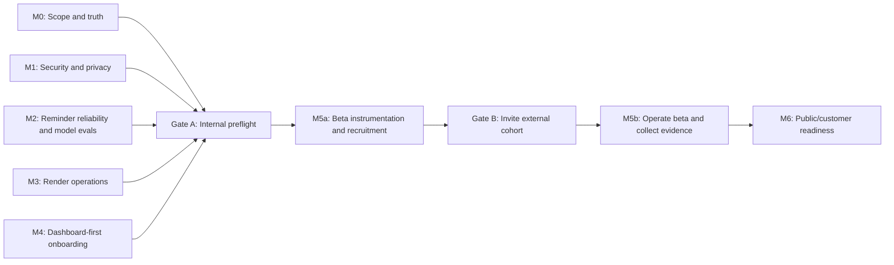
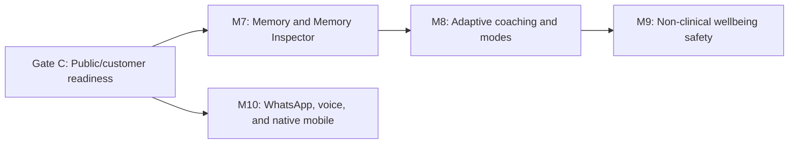

# Amigo Pre-Launch Implementation Plan

**Created:** 2026-08-26
**Last reviewed against deployed UI:** 2026-08-29
**Input:** [Pre-Launch Gap Analysis](pre-launch-gap-analysis.md)
**Decision map:** [Amigo Complete Product Wayfinder Map](../.scratch/amigo-complete-product/MAP.md)
**Capability source of truth:** [Amigo Capability Matrix](capability-matrix.md)
**Target outcome:** A secure, honest, observable, invitation-only beta that reliably completes
the task → reminder → resolution loop across Telegram and the dashboard.

## Product decision for this plan

This plan treats the Phase 1 product as:

> **Tell Amigo what you need to do. It turns the conversation into a task and sends you a
> Telegram reminder at the time you choose, with simple Done, Skip, or Later controls.**

Use **AI accountability companion** as the beta category. The complete shipped capability and
exclusion contract lives in the resolved Wayfinder decision
[Lock the Beta Promise and Capability Exclusions](../.scratch/amigo-complete-product/decisions/02-beta-promise-and-exclusions.md).

The following are **not required to open the first invitation beta**, but remain explicit parts
of the intended Amigo product:

- Temporal or semantic memory.
- Memory Inspector.
- Adaptive coaching.
- Recommender, Coach, and Reflect modes.
- Non-clinical supportive reflection, CBT-informed exercises, mood journaling, and localized
  crisis-resource referral.
- WhatsApp, voice, and native mobile apps.
- Multi-machine scheduling.
- Paid billing.

This is evidence-gated sequencing. The beta first proves identity, trust, conversation quality,
reminders, and retention. Every roadmap capability must receive a ship-or-do-not-build decision
based on demand, safety, cost, privacy, and retention evidence. Roadmap capabilities should not
appear in customer copy as current features until their release gate passes.

## Confirmed founder decisions

- **Entry point:** Dashboard first. A new user creates a dashboard account, then connects the
  Telegram bot as part of onboarding.
- **First release:** A closely supported external invitation beta, not a private customer-demo
  phase.
- **Beta hosting:** Render is the canonical deployment for the beta. Upgrade the Render service
  before the first invitation to one always-on paid instance with at least 0.5 CPU/512 MB in
  Oregon or the closest US-West region to Supabase. Keep the free Singapore service for
  development only and retain one scheduler owner during beta.
- **Target Segment:** English-speaking adults 18+ who struggle with everyday task follow-through
  and repeatedly abandon conventional task apps, excluding people seeking diagnosis, therapy,
  treatment, or crisis care.
- **Initial operational market:** Recruit in the United States and Canada without hard
  geo-blocking. Do not claim evaluated support for other markets until their expansion gate
  passes.
- **Wellbeing boundary:** Amigo is a non-clinical companion. It may offer supportive reflection,
  CBT-informed exercises, mood journaling, and crisis-resource referral; it does not diagnose,
  provide treatment or therapy, or promise monitored crisis response.
- **Control posture:** Keep controls proportionate to a small invitation beta. Minimum tenant
  isolation, pairing security, consent, retention disclosure, export/deletion support, and safety
  boundaries remain release requirements; detailed multi-jurisdiction expansion review waits
  until expansion is proposed.
- **Settled contracts:** Release gates, beta promise and offer, privacy/retention, Task/Reminder
  lifecycle, cross-surface state, runtime topology/I/O/capacity, model evaluation, Dashboard-first
  Activation, cohort/recruitment, hosted pricing hypothesis, Memory trust, Modes/adaptation,
  non-clinical wellbeing, Surface Expansion, Reminder reliability measurement, and AGPL-3.0
  source/contribution/security reporting are recorded in the Wayfinder map.
- **Still to decide when their evidence gates open:** durable Memory storage/retrieval technology,
  a narrow Recommender domain, whether automatic routing is ever justified, international Crisis
  Referral expansion, and the detailed WhatsApp, voice, and mobile contracts.

## Wayfinder review and implementation readiness

This document is the strategic roadmap. The Wayfinder map is authoritative for unresolved
decisions. Do not publish an AFK implementation issue whose behavior or acceptance threshold
depends on an open decision ticket.

Core beta implementation can proceed against the closed contracts. Post-beta work must remain
behind its demand and release gates; open technology or surface-specific tickets are resolved only
when their prerequisite evidence exists. Implement core lifecycle behavior against the approved
[Task/Reminder lifecycle contract](../.scratch/amigo-complete-product/decisions/05-task-reminder-lifecycle.md).

## Beta exit criteria

Amigo can enter an invitation-only beta only when all of these are true:

- A new user can create and verify a dashboard account, connect Telegram, complete bot
  onboarding, and receive a guided test reminder.
- Task creation, reminder scheduling, Done/Skip/Later, and dashboard changes remain consistent.
- Replaying a Telegram update cannot duplicate tasks, messages, or reminders.
- Ambiguous times cause a clarification rather than a wrong reminder.
- Two authenticated users cannot access or mutate each other's data.
- Pairing tokens cannot be read or mutated through the client API.
- Production cannot start with unsafe empty security configuration.
- Privacy, terms, and retention behavior are available to users, with a tested manual export and
  deletion process for the small beta cohort. Self-service export and deletion remain required
  before public launch.
- Production errors, reminder lateness, activation, and provider cost are observable.
- A representative beta-sized burst of concurrent conversations and due reminders meets the
  documented latency, lateness, and error thresholds without starving the event loop.
- A staging end-to-end test and backup restore exercise pass.
- Public copy, screenshots, links, and documentation describe only shipped behavior.

## Delivery strategy and release gates

The milestones are work areas, not a strict waterfall. Security, reliability, operations, and
onboarding slices should be implemented in parallel where dependencies allow. Progress is
controlled by three release gates:

- **Gate A — Internal preflight:** Honest scope, locked-down pairing, one reliable core-loop path,
  Render beta topology verified, and a staging end-to-end test.
- **Gate B — Open external invitation beta:** Dashboard-first onboarding, basic privacy rights,
  monitoring, feedback triage, and beta analytics are operational and all beta exit criteria
  pass. Invite 5–10 users from one segment and keep direct founder contact.
- **Gate C — Public/customer readiness:** Self-service data rights, legal review, polished demo,
  customer evidence, custom domain, broader accessibility, and scale/recovery evidence.

Exact waiver policy, thresholds, ownership, stop/resume behavior, and evidence validity are
defined in the resolved Wayfinder decision
[Define Release Evidence and Gate Thresholds](../.scratch/amigo-complete-product/decisions/01-release-evidence-and-gates.md).

Complete the Gate A portions of Milestones 0–4 to pass internal preflight. Work explicitly marked
Gate B in those milestones, plus the instrumentation, support, recruitment, and stop-condition
setup in Milestone 5, must pass before inviting users. Continue Milestone 5 to operate the cohort
and collect evidence. Milestone 6 and the remaining public-launch controls form Gate C.

After Gate C, product expansion proceeds through four dependent horizons:

Memory transparency precedes adaptive behavior because users must be able to see and correct the
facts driving personalization. Channel groundwork may proceed independently after Gate C, though
voice or channel experiences that expose wellbeing features inherit the Milestone 9 safety gate.
Diagnosis, clinical treatment, psychotherapy, and monitored crisis response are outside this
product destination; a disclaimer does not authorize those functions or claims.

## Milestone 0 — Scope, positioning, and repository hygiene

**Goal:** Make the product promise honest and establish one release source of truth.

### Work

1. Create `docs/capability-matrix.md` with three columns: Shipped, Beta experiment, Roadmap.
2. Rewrite the README, blog post, `docs/what-is-amigo.md`, dashboard copy, and bot copy using
   the Phase 1 positioning above.
3. Remove or label claims for proactive morning/evening outreach, anti-nag behavior, temporal
   memory, Memory Inspector, adaptive coaching, sentiment gating, Claude routing, pgvector,
   and wellbeing support.
   **Local status (2026-08-29):** steps 1–3 are implemented. The capability matrix is canonical;
   README, the unpublished launch article, `docs/what-is-amigo.md`, dashboard labels, pairing and
   onboarding copy, and the model prompt now distinguish shipped behavior from experiments and
   roadmap. Unavailable Modes and WhatsApp are hidden from the beta dashboard.
4. Replace placeholder repository and Telegram links and add verified screenshots.
   **Local status (2026-08-29):** the clone URL and bot username are no longer placeholders, and
   the unpublished article no longer references missing screenshots. Verified release screenshots
   remain pending until the corrected dashboard is deployed.
5. Declare Render and its backend/dashboard URLs as canonical for the beta. Mark Fly as an
   inactive future deployment option so it cannot appear to be a second production scheduler or
   webhook owner.
6. Implement the founder-approved source contract from Wayfinder ticket 21: apply AGPL-3.0 to
   Amigo's original repository work while preserving identified third-party rights; add the
   canonical root `LICENSE`; document DCO 1.1 `Signed-off-by` contributions without a CLA in
   `CONTRIBUTING.md`; and add `SECURITY.md` with GitHub private vulnerability reporting,
   three-business-day acknowledgement and seven-business-day assessment targets, coordinated
   disclosure, and no unsupported bounty or remediation promise. Enable private vulnerability
   reporting in GitHub. Do not equate open source with supported self-hosting.
   **Local status (2026-08-29):** the three files, README notices, and package SPDX metadata are
   implemented and verified. Enabling GitHub private vulnerability reporting remains pending
   because no authenticated GitHub session was available during implementation.
7. Finish the prepared `node_modules/` cleanup: review and commit the index removals and ignore
   rule, then prove clean install, lint, test, and build behavior without reintroducing generated
   files.
   **Local status (2026-08-30):** complete. `node_modules/` is ignored and no longer tracked;
   `npm ci`, ESLint, and the Vite production build pass from the lockfile. The missing ESLint
   dependencies and flat configuration were added, React Hook dependency findings were fixed,
   and both the full and production-only npm audits report zero vulnerabilities.
8. Correct model names, deployment instructions, migration order, test counts, and broken doc
   links.
   **Local status (2026-08-30):** README model, Render/Fly status, both-migration order, current
   test count, repository URL, and current `gemini-3.5-flash` default are corrected. The local
   Markdown link audit passes; a full clean-clone contributor walkthrough remains pending.

### Acceptance criteria

- No public document describes a roadmap feature in the present tense.
- One capability matrix is linked from the release checklist.
- Every public URL and screenshot works.
- A clean clone has no generated dependency tree checked in.
- A new contributor can follow the README without guessing a URL, migration, or platform.

## Milestone 1 — Security, privacy, and account control

**Goal:** Remove the highest-risk data exposure and establish a defensible trust baseline.

### Workstream 1.1: Pairing and RLS

1. Audit actual production grants on `pairing_tokens` before changing code.
2. Create a new reviewed migration that:
   - Enables RLS on `pairing_tokens`.
   - Revokes `anon` and `authenticated` access.
   - Grants access only to the service-role backend path.
   - Adds expiry cleanup and appropriate indexes.
3. Replace the broad profile update policy with column-safe backend endpoints or restricted RPCs.
4. Add two-user security integration tests for profiles, tasks, reminders, sessions, messages,
   feedback, usage events, and pairing tokens.
5. Ensure task and reminder mutations include `user_id` ownership predicates at the store layer.
6. Review pairing behavior when a Telegram profile or Supabase account is already linked.
7. Add pairing-token generation limits and invalidate older unconsumed tokens for the same auth
   account.

**Local status (2026-08-30):** Items 1 through 7 are implemented in migrations 003–004, the Store
layer, and automated Pairing/ownership tests. CI applies all migrations and runs a two-participant
PostgreSQL matrix with Supabase-compatible roles. Staging/production application remains manual.

### Workstream 1.2: Production access control

1. Add explicit access modes such as `closed`, `allowlist`, and `invite`.
2. Make production startup fail when webhook secret, Telegram token, Supabase credentials,
   dashboard origin, access mode, or model credentials are unsafe or missing.
3. Add per-chat request limits, maximum message length, model quotas, and a global kill switch.
4. Start recording token usage and configurable cost alarms.
5. Redact message content, tokens, pairing links, and personal data from operational logs.

**Local status (2026-08-30):** Items 1 and 2 are implemented with production-safe access modes,
startup validation, callback enforcement, and configuration tests. Items 3 through 5 remain open,
and the configuration validator has not yet been verified in staging.

### Workstream 1.3: Privacy and user rights

The authoritative beta data inventory, purposes, retention, processors, consent, export,
deletion, correction, support, and incident-communication contract is the resolved Wayfinder
decision
[Define the Proportionate Beta Privacy and Retention Contract](../.scratch/amigo-complete-product/decisions/04-beta-privacy-retention.md).

1. Implement and publish the approved retention schedule for messages, sessions, tasks, feedback,
   usage events, logs, backups, and expired Pairing tokens.
2. Implement and test a founder-operated export process for beta users; schedule authenticated
   self-service export before public launch.
3. Implement and test a founder-operated deletion process with deletion propagation and a
   confirmation step; schedule self-service account deletion before public launch.
4. Add user-facing commands or links for privacy, export, delete account, and support.
5. Publish reviewed Privacy Policy and Terms documents that disclose Telegram, Supabase, model
   providers, data location, retention, user rights, product limitations, and acceptable use.
6. Define an age, eligibility, and consent policy for the beta.
7. Remove mental-health, CBT, mood-treatment, therapy, and crisis-service claims from beta copy
   unless the corresponding Milestone 9 release gate has passed.

### Tests

- Anonymous and authenticated clients cannot select pairing tokens.
- User A cannot select or mutate User B's rows by guessed UUID.
- Client-side requests cannot update identity or internal profile columns.
- Expired, replayed, or superseded pairing tokens fail.
- Production configuration tests fail closed.
- Manual beta export contains the documented data; manual beta deletion removes or anonymizes
  every documented record.

### Acceptance criteria

- Security integration tests run in CI against an isolated Supabase project or local stack.
- No high-risk table is client-accessible without a tested RLS policy.
- User-facing privacy and terms are available, and beta users can request a tested export or
  deletion through a documented support path.
- External beta access is invitation-controlled and rate-limited.

## Milestone 2 — Reminder correctness, model behavior, and cross-surface consistency

**Goal:** Make the core promise boringly reliable.

**Authoritative behavior:** Implement and test the approved
[Task/Reminder lifecycle contract](../.scratch/amigo-complete-product/decisions/05-task-reminder-lifecycle.md).
It supersedes the current `created_date` daily population, `deferred` Task status, in-place
Reminder snooze, silent future-time parsing, and dashboard-only 15-minute snooze behavior.
All surfaces must implement that behavior through the approved
[cross-surface state contract](../.scratch/amigo-complete-product/decisions/06-cross-surface-state-contract.md).

### Workstream 2.1: One mutation path

1. Add typed authenticated backend command endpoints for:
   - Create task.
   - Update task status.
   - Cancel task (a terminal soft state; account/data deletion remains a separate privacy flow).
   - Schedule/reschedule reminder.
   - Apply Later to a reminder.
   - Cancel reminder.
2. Route dashboard actions through these endpoints rather than direct table writes. Resolve the
   authenticated actor server-side; never accept `user_id` as command input.
3. Keep side effects behind injected Tools/application commands and preserve Store implementation
   parity. Telegram and dashboard adapters must invoke the same domain operations.
4. Implement reviewed PostgreSQL transactional functions behind `MemoryStore` so each command
   atomically records Task/Reminder transitions, aggregate version, idempotent command receipt,
   canonical response, and durable scheduler-outbox effects. Independent Supabase REST writes do
   not satisfy this requirement.
5. Implement one `LaterPolicy` or equivalent domain operation used by Telegram and the dashboard:
   +60 minutes, then +30 minutes, then next local planning day at `wake_time`, adjusted for quiet
   hours. Each Later action acknowledges the current Reminder and creates a replacement; it never
   rewinds a terminal Reminder row.
6. Enforce the canonical Task states (`pending`, `completed`, `skipped`, `cancelled`) and Reminder
   states (`pending`, `sending`, `sent`, `acknowledged`, `missed`, `failed`, `cancelled`) with
   tenant-owned, idempotent transitions and at most one active Reminder per Task.
7. Require stable idempotency keys and payload hashes. Return the stored result for a matching
   replay and `409 Conflict` for key reuse with different input or a stale dashboard version.
8. Return `202 Accepted` when durable scheduler effects remain queued, including the canonical
   resource/result, version, intended time, and effect state.

**Local status (2026-08-31):** Create Task and Reminder schedule/reschedule/cancel now use shared
authenticated Telegram/dashboard commands. Reviewed PostgreSQL functions atomically persist
participant-scoped receipts, canonical Task/Reminder state, aggregate versions, exact intended
time, and stable scheduler-outbox effects. The worker safely replays committed effects, dashboard
scheduling returns `202 Accepted`, and direct browser Reminder updates are revoked. Task and
Reminder Done/Skip/Cancel now use one atomic command across Telegram and dashboard, with stale
version protection, sent-Reminder acknowledgement, durable cancellation effects, and direct
browser Task mutations revoked. Telegram and dashboard Later now share the +60/+30/next-day
replacement policy, quiet-hour adjustment, exact local-time receipt, and atomic scheduler effects.
Reminder-time resolution now returns the complete local date, wall time, IANA timezone, UTC
instant, confidence, and clarification/confirmation state. Ambiguous, contradictory, passed, and
nonexistent DST wall times cannot mutate Reminder state; repeated hours use the earlier occurrence
unless the participant explicitly selects the later one.
Telegram ingestion now atomically claims each supported `update_id`, safely acknowledges duplicate
deliveries, retains content-free terminal outcomes, derives command keys from the stable update ID,
and serializes active Turns per participant within the single beta web process.

### Workstream 2.2: Telegram idempotency and ordering

1. [x] Persist Telegram `update_id` with an atomic claim before processing.
2. [x] Return a safe Telegram acknowledgment without silently discarding failed internal work.
3. [x] Make tools idempotent under update replay.
4. [x] Add per-user turn serialization to preserve message order.
5. [x] Add deduplication keys for task and reminder creation that do not prevent legitimate repeated
   tasks on different days.

### Workstream 2.3: Time semantics

1. [x] Replace `HH:MM`-only parsing with a result that includes date, time, timezone, confidence, and
   whether clarification is required.
2. [x] Ask the user to clarify bare hours such as “at 8.”
3. [x] Clarify or explicitly confirm fuzzy periods such as breakfast, lunch, dinner, tonight,
   tomorrow morning, and after work before persistence; do not silently assign a conventional
   clock time.
4. [x] Make DST gaps and repeated hours explicit.
5. [x] Store Task `due_date` as the intended local planning day and each Reminder's UTC instant plus
   intended local date/time/IANA timezone. Implement the approved DST-gap and repeated-hour rules.
6. Treat `created_at`/legacy `created_date` as audit metadata. Use due date, user timezone, and
   lifecycle state for daily views; leave commitments without an explicit planning day in Inbox.
7. [x] Apply configured `sleep_time` → `wake_time` quiet hours, including confirmation for explicit
   quiet-hour scheduling and wake-time adjustment for automatic Later actions.

### Workstream 2.4: Scheduler invariants

1. Document exactly one scheduler owner for beta.
2. Add a scheduler heartbeat and reminder-lateness measurement.
3. Ensure startup reload, live reschedule, dashboard Later, and Telegram Later all share the same
   code path.
4. Deliver a Reminder at most once when it is no more than 15 minutes late and record delayed
   timing; mark older Reminders missed, keep their Tasks pending, and emit at most one recovery
   summary rather than stale-message bursts.
5. Add a reconciliation job that detects pending database reminders without scheduled jobs.
6. Reconcile the inverse case as well: scheduled jobs whose reminder is missing, terminal, or
   owned by a different task/user must be cancelled and reported.
7. Add an idempotent outbox worker with atomic claims, stable effect/job IDs, bounded retry and
   visible poison-effect state. Measure outbox lag, oldest pending effect, failed effects, and
   reconciliation drift.

### Workstream 2.5: Consistent dashboard read model

1. Replace independent browser queries with `GET /api/dashboard`, one authenticated,
   tenant-scoped, versioned snapshot for tasks, progress, reminders, and recent sessions. Assemble
   it from one consistent database view/transaction.
2. Define and enforce these invariants:
   - Every displayed pending reminder resolves to an owned task that is visible or explicitly
     identified as carried over from another day.
   - The progress numerator, denominator, and task list use the same task population.
   - “No tasks pending” cannot be shown when a pending task-backed reminder is presented without
     an explanation.
   - Dates are calculated in the user's current timezone and remain deterministic across
     midnight.
3. Show reminder date, localized time, timezone, and overdue/delivery state rather than a bare
   clock time.
4. Version or atomically assemble the snapshot so realtime updates cannot produce a temporary
   mixed state from different queries.
5. Show unscheduled commitments in Inbox and past-due pending Tasks in a separate Carried over
   section. Neither population contributes to today's completion denominator.
6. Make realtime, if retained, an invalidation hint only. After mutations or invalidation, fetch
   and atomically replace the snapshot; never merge direct table payloads into dashboard state.

### Workstream 2.6: Model-behavior evaluation

**Gate A minimum:** establish a small regression set for the core promise before internal
preflight. **Gate B extension:** expand language and adversarial coverage before inviting users.

The authoritative behavior, safety, Tool-authorization, case, threshold, and evidence contract is
[Wayfinder ticket 09](../.scratch/amigo-complete-product/decisions/09-model-evaluation-contract.md).

1. For Gate A, create a versioned, non-sensitive minimum evaluation set covering:
   - One and multiple tasks in a single message.
   - Create, complete, skip, cancel, Later, move-date, and reschedule intents.
   - Ambiguous, missing, relative, and contradictory dates/times.
   - Corrections, short replies, greetings, emotional statements, and irrelevant conversation.
   - Basic ownership and prohibited-mutation cases.
2. For Gate B, extend the set with realistic Nepali/English and Hindi/English messages,
   prompt-injection attempts, guessed task IDs, cross-user requests, and observed de-identified
   failure patterns from internal testing.
3. Record expected tool calls, prohibited tool calls, clarification requirements, and acceptable
   response properties rather than relying only on exact response text.
4. Run the applicable gate suite against the configured production model and prompt in CI or a controlled
   pre-deploy evaluation job.
5. Require an explicit evaluation comparison before changing the model, system prompt, tool
   descriptions, or time-resolution behavior.
6. Store no real beta conversations in the evaluation set without explicit consent and
   de-identification.
7. Implement Gate A as 60 cases and Gate B as 120 total cases with the approved category
   composition. Run every applicable case three times as one declared evaluation run.
8. Enforce 100% hard-invariant, safety-boundary, required-English, and mutation-risk ambiguity
   behavior. Independently enforce the approved 98% Tool/state, 95% extraction, 98%
   clarification/no-unnecessary-mutation, 95% factual/error-handling, 90% tone, and 90%
   code-mixed-comprehension thresholds; do not allow an aggregate score to hide a weak category.
9. Keep English as the beta response language. Evaluate required Nepali-English and Hindi-English
   core-intent comprehension at Gate B, but remove the unverified full-language matching promise.
10. Evaluate ordinary distress, requests for clinical help, imminent-danger language, casual
    idioms, and prohibited monitoring/diagnosis/treatment claims against the approved non-clinical
    behavior. Distress content alone never authorizes mutation.
11. Run a deterministic subset on relevant pull requests, Gate A on release candidates and every
    model/prompt/Tool/context/time/safety change, and Gate B before invitation or evidence expiry.
    Record the exact release inputs, traces, scores, latency, tokens, and cost; never retry an
    unchanged failed candidate merely to obtain a lucky pass.

### Workstream 2.7: Reminder reliability measurement

The authoritative measurement contract is
[Wayfinder ticket 20](../.scratch/amigo-complete-product/decisions/20-reminder-reliability-measurement.md).

1. Measure one immutable Eligible Reminder occurrence, not attempts. Include valid future
   occurrences active at their scheduled instant; exclude pre-due cancellation only with a durable
   timestamp. Keep runtime outages in the denominator and staging synthetic results separate.
2. Through a reviewed migration, record confirmation, scheduled, first-claim, provider-acceptance,
   terminal, acknowledgement, and cancellation timestamps plus an immutable attempt ledger with
   timing, result, idempotency key, normalized cause, and retry decision. Treat uninstrumented
   historical rows as Unmeasurable.
3. Define success as Messaging Channel provider acceptance within 15 minutes, not device receipt or
   reading. Calculate Reminder Lateness, Scheduler Lag, and Provider Latency from the approved UTC
   timestamps; participant acknowledgement is engagement only.
4. Retry at most three total attempts inside the window, only after explicit retry-safe
   non-acceptance. Do not retry ambiguous outcomes without provider idempotency. Never erase an
   attempt by reverting silently to `pending`; stop new sends at 15 minutes.
5. Publish End-to-End Reliability for all Eligible Reminders and Healthy-Provider Reliability that
   excludes only a predeclared official incident or three failed provider probes across five
   minutes while Amigo/app database health passes. Never exclude isolated or Amigo-caused errors.
6. Reconcile at least once per minute for missed, stuck, timestamp-incomplete, duplicate-accepted,
   and due-without-attempt occurrences. Alert on every missed/failed, duplicate, cross-account,
   post-cancellation, or inconsistent terminal outcome; warn after 60 seconds unclaimed or three
   minutes without scheduler heartbeat.
7. Run an hourly production synthetic to a dedicated operator endpoint and report it separately.
   Retain content-free detailed metadata for 90 days and aggregates for 12 months.
8. Report counts, exclusions, percentage, p50/p95/max, causes, retries, and provider incidents for
   current day, trailing seven days, and cumulative gate window. Use nearest-rank percentiles and
   label fewer than 20 successes Insufficient Evidence rather than claiming p95.

### Tests

- Replay the same Telegram update concurrently and assert one turn, task, and reminder.
- Send two rapid messages from one user and assert deterministic order.
- Exercise schedule, reschedule, Later, Done, Skip, Cancel, deploy/restart, and late recovery.
- Test user timezones with half-hour offsets, positive/negative UTC offsets, DST transitions,
  midnight, and ambiguous local hours.
- Assert dashboard Later changes the actual job fire time.
- Assert dashboard and Telegram apply the same +60/+30/next-day Later sequence, quiet-hour
  adjustment, replacement-Reminder transitions, and terminal behavior.
- Cover a legacy task with a pending reminder, cross-midnight rollover, overdue reminders, and
  the previously observed `0 of 0` plus active-reminder contradiction.
- Inject database, scheduler, and Telegram failures at each side-effect boundary.
- Replay identical and conflicting idempotency keys, submit a stale aggregate version, interrupt
  outbox processing, and prove worker replay plus reconciliation converges without lost intent.
- Run the model evaluation set and assert correct/prohibited tool behavior, clarification, and
  tenant isolation.

### Acceptance criteria

- The complete reminder state machine passes integration tests.
- No dashboard action can leave the database and scheduler in knowingly inconsistent states.
- Every accepted command either commits its complete database transition plus durable effects or
  changes nothing; no scheduler outage can lose an accepted user intent.
- Dashboard task, progress, and reminder views satisfy the documented population invariants.
- Ambiguous time never silently becomes a reminder at an unintended hour.
- Inbox, today, and Carried over populations follow the approved due-date rules, and midnight does
  not silently rewrite Task dates.
- No evaluation case permits a tool mutation outside the injected user's ownership boundary.
- The production model/prompt meets documented minimum scores for task extraction, status
  updates, clarification, and mixed-language cases.
- Staging completes 100 Eligible Reminders across three runs including the Representative Beta
  Burst with at least 99% in-window acceptance, p95 lateness at most 10 seconds, maximum at most 30
  seconds, and zero duplicate/cross-account delivery.
- Provisional live evidence requires 50 Eligible Reminders from five participants across seven
  days; Customer Readiness requires 100 from five participants across 14 days. Both require at
  least 99% Healthy-Provider Reliability, p95 lateness under five minutes, cumulative and eligible
  trailing-seven-day passage, and no participant with more than one Amigo-attributable failure.
- An insufficient sample cannot pass. Every failure is reviewed; duplicate or cross-account
  delivery is a hard gate failure.

## Milestone 3 — Render deployment, observability, and recovery

**Goal:** Operate the beta without discovering failures from user complaints.

### Workstream 3.1: Deployment

1. Make Render the only active beta deployment and webhook owner. Mark Fly configuration as
   inactive/future so it cannot be deployed accidentally as a competing scheduler.
2. Add a staging environment with separate Telegram bot, Supabase project, dashboard, and model
   quota.
3. Verify that the selected Render service remains continuously running and supports exactly one
   scheduler owner. Upgrade the Render plan before beta enrollment if that invariant or the
   reminder-lateness SLO cannot be guaranteed.
4. Add schema version validation at startup or deployment.
5. Require CI and a staging smoke test before production promotion.
6. Add rollback instructions for application and migration releases.

### Workstream 3.2: Observability

1. Add structured logs with request/update ID, redacted user key, session ID, tool name, outcome,
   and duration.
2. Add exception tracking for FastAPI, agent runs, Telegram delivery, dashboard API calls, and
   scheduler jobs.
3. Add traces or metrics for model latency, database latency, tool calls, tokens, and cost.
4. Split `/health` into liveness and readiness.
5. Alert on the ticket 20 Reminder conditions, webhook error rate, provider failure rate, scheduler
   heartbeat loss, and cost thresholds. Keep provider-incident evidence and End-to-End versus
   Healthy-Provider views explicit.

### Workstream 3.3: Resilience

1. Add explicit provider timeouts and bounded retries.
2. Add graceful user responses for model, database, and Telegram outages.
3. Configure database backups and retention.
4. Perform and document a staging restore.
5. Write runbooks for deployment, rollback, leaked secrets, Telegram webhook recovery, database
   outage, model outage, reminder duplication, and scheduler failure.

### Workstream 3.4: Non-blocking database access and representative load

**Dependency:** M3.2 must establish the event-loop and database baseline before the client path
changes. The resulting non-blocking store path protects M2 reminder correctness. Removing direct
blocking I/O is required for Gate A; the representative beta burst and documented safe limit are
required for Gate B.

**Observed production baseline (2026-08-29):** The
[runtime-baseline task](../.scratch/amigo-complete-product/decisions/07-runtime-baseline.md) found a
single sleeping Render Free instance (0.1 CPU/512 MB) running both Uvicorn and in-process
APScheduler, plus a cross-region Supabase Free NANO database in `us-west-2`. Supabase's ambient
snapshot was 3% CPU, 51% RAM, and 8/60 connections; Render Free exposed no application CPU/RAM
history. Event-loop delay, database-call latency, Turn latency, and Reminder lateness are
uninstrumented and therefore unknown. A ten-request concurrent `/health` sample (median ~142 ms,
max 400 ms) measured only warmed process liveness and is not a beta workload result. Render sleep
alone makes the current topology ineligible for the Reminder beta.

1. Instrument event-loop delay and establish a staging baseline for database calls, concurrent
   Turns, and Reminder delivery before changing the client path. Unknown production metrics from
   the topology baseline must not be treated as zero or passing.
2. Replace synchronous Supabase access with the SDK's native `AsyncClient` across store and
   authentication paths. A bounded worker-thread adapter is allowed only as a documented temporary
   fallback for a specific incompatible SDK operation. Human-review the protected singleton
   wiring and add regression coverage against blocking I/O returning to event-loop paths.
3. Keep all database access behind `MemoryStore`. Mirror any interface changes in
   `InMemoryStore` and `FakeStore`, and preserve the existing ownership boundaries.
4. Before the first invitation, deploy one always-on paid Render instance with at least 0.5 CPU
   and 512 MB RAM in Oregon or the closest US-West region to Supabase. Keep one application and
   scheduler owner; Fly.io and horizontal scaling are not on the beta critical path.
5. Enforce one active Turn per participant, four active Turns globally, a 20-Turn waiting queue,
   and at most 12 concurrent Supabase operations. Give Reminder/outbox work a separate
   higher-priority four-worker lane with capacity for 100 pending effects. Reject excess work
   with an explicit retry-later response and expose utilization, queueing, and rejection metrics.
6. Run the representative mixed staging burst three consecutive times: represent 10 authenticated
   participants, five simultaneous Turns with ordered follow-ups, 10 dashboard snapshots and 10
   due Reminders within one minute (five while Turns are active), one duplicate webhook, and one
   transient dependency failure. Require no incorrect/duplicate/cross-user effect, unexpected
   error, timeout, restart, or rejection; event-loop p95/max at most 50/250 ms; Turn p95/max at
   most 15/30 seconds; healthy-provider Reminder-lateness p95/max at most 10/30 seconds; at least
   20% CPU and memory headroom; no connection exhaustion; fully drained queues; and correct
   bounded retry/reconciliation of the injected failure.
7. Add a larger capacity and soak test before expanding beyond the invitation cohort; this later
   test is not required to invite the first small cohort if the representative beta burst passes.

### Acceptance criteria

- A synthetic staging user completes the core loop after every deployment.
- Operators receive an alert for an intentionally injected reminder failure.
- Readiness fails when a required production dependency or scheduler heartbeat is unavailable.
- No synchronous Supabase network call executes directly on the application event loop.
- The representative beta workload meets the documented turn-latency, event-loop-delay,
  reminder-lateness, error-rate, and resource thresholds on the selected Render service.
- The tested limit and backpressure behavior are documented before invitations are issued.
- A backup is restored successfully into staging and verified.
- The application can be rolled back by following the runbook alone.

## Milestone 4 — Onboarding, dashboard, mobile, and accessibility

**Goal:** Move a first-time user to a successful reminder quickly and without confusion.

### Workstream 4.1: Dashboard-first canonical onboarding

> **Founder decision supersedes the gap analysis:** The earlier assessment recommended Telegram
> as the canonical entry point. The confirmed product direction is now dashboard account first,
> followed by Telegram connection during onboarding; this plan is authoritative.

1. Start every new beta user on the dashboard with account creation and email verification.
2. Present the narrow product promise, beta limitations, and privacy/terms acknowledgment before
   generating a pairing token.
3. Guide the user from the dashboard into Telegram using the expiring deep link or QR code.
4. Use a focused one-primary-action layout: a progress rail on desktop and compact progress on
   mobile. Show a dashboard/Telegram preview only at Pairing and test-Reminder resolution steps.
5. After Telegram consumes the token, detect success automatically and return/resume on the
   dashboard for preferred name, explicit IANA timezone, and beta quiet-hour setup. Telegram
   confirms the linked dashboard account without exposing identifiers and provides a return path.
6. Replace the hardcoded Kathmandu guess with explicit selection or a clearly labeled hint; use
   the browser timezone as a suggestion when it can be passed safely through the pairing flow.
7. Create one clearly labelled private test Task and propose its Reminder for two minutes in the
   future. Confirm the exact date, local time, and timezone before scheduling.
8. Require actual Telegram delivery and resolution through Done, Skip, or Later. Scheduling alone
   does not complete Activation. Detect the result automatically, reflect it on the dashboard,
   then unlock the normal dashboard with one next action: add a real Task.
9. Persist versioned journey progress and resume the first incomplete step across desktop/mobile.
   Use the full checklist only as a return/recovery view. Provide explicit recovery for email
   verification, expired/replaced/used tokens, closed-dashboard return, and failed/late test
   delivery; never mark Activation complete from an error or timeout.
10. Add `/help`, `/settings`, `/mute`, `/timezone`, `/privacy`, and `/delete_account` paths or
   equivalent conversational intents.
11. Validate and normalize display names during onboarding while preserving the user's preferred
   spelling and capitalization. The bot should not expose inconsistent casing in greetings.
12. Treat a casual greeting as a conversational bridge into the core loop. Prefer one clear next
   question over stacked prompts such as asking how the user is and what is planned for today in
   the same reply.
13. Define transparent companion language for questions such as “How are you?” Avoid implying
   human feelings or experiences; use warm wording such as “I'm here and ready to help.”

### Workstream 4.2: Dashboard simplification

The deployed unpaired-account screen is visually coherent, but it currently presents normal
onboarding as an error and repeats the same state through the warning banner, disabled Dashboard
navigation, active Connect Apps navigation, page heading, and Telegram tab. Replace it with a
single-purpose setup journey.

1. Hide unavailable modes and WhatsApp. Do not use “Apps” or “messaging platforms” in beta copy
   when Telegram is the only supported channel.
2. Replace “Account pairing required” with a neutral onboarding state such as “Finish setting up
   Amigo — connect Telegram.”
3. Rename “Connect Apps” to “Connect Telegram” or “Finish setup.”
4. Use a dedicated setup layout for unpaired users instead of rendering the full application
   sidebar with a disabled Dashboard destination.
5. Show the approved compact progress sequence: `Account → Limits → Telegram → Profile → Test
   Reminder → Resolve → Dashboard`.
6. Explain why pairing is needed, what becomes visible after pairing, and what data is linked.
7. Show pairing-token expiry as a countdown and provide “Generate new code.” Generating a new
   code must invalidate any prior unconsumed code for that account.
8. Do not describe pairing failures as generic account errors. Distinguish expired, already used,
   already linked, offline, and server-failure states and give each a recovery action.
9. Reduce duplicated visual state: one setup heading, one explanatory paragraph, one QR code, and
   one primary Telegram CTA are sufficient.
10. Add a small dashboard preview or “After connecting, you can…” list to make the value unlocked
    by pairing concrete.
11. Explain the dashboard's beta role: review tasks, manage reminders, and see recent sessions.
12. Add visible loading, empty, offline, permission, and retry states throughout the paired
    dashboard.
13. Add reminder settings for timezone, quiet hours, and notification intensity.
14. Add account recovery, resend confirmation, support, privacy, and terms links.
15. Complete the cross-surface handoff after Telegram consumes the pairing token:
    - Telegram confirms which dashboard account was linked without exposing sensitive IDs.
    - The message includes a clear “Return to dashboard” action or instruction.
    - The open dashboard detects the completed pairing and transitions automatically without a
      manual refresh.
    - The dashboard shows a short success state before revealing the first useful view.
16. If pairing creates a Telegram profile that has not completed bot onboarding, continue
    directly into name/timezone setup instead of sending a success message and waiting for an
    unrelated next message to restart onboarding.

### Workstream 4.3: Responsive and accessible UX

1. Replace the fixed sidebar with mobile navigation below the chosen breakpoint.
2. Test authenticated dashboard and pairing layouts at 320, 390, 768, and desktop widths.
3. Add accessible names for icon controls and bind labels to inputs.
4. Make unavailable controls actually disabled or remove them.
5. Separate focus and selection styling so the active navigation item does not look as if it has
   two conflicting orange/gold borders.
6. Add keyboard navigation, focus, reduced-motion, contrast, and screen-reader checks.
7. Add automated accessibility tests and a manual keyboard/screen-reader checklist.

### Workstream 4.4: Dashboard trust, sessions, and connection controls

1. Stop treating every session with a null `ended_at` as currently active. Define an inactivity
   timeout using last message/activity time and close or reconcile stale sessions even when the
   user never sends another message.
2. Display human labels such as “Morning planning,” not internal values such as
   `morning_planning`. Show last activity and format duration in minutes, hours, or days with a
   documented upper bound; never show unbounded values such as `85881m`.
3. Add a maintenance/reconciliation path for already-stale production sessions and verify that
   it is idempotent before running it against production data.
4. Hide the raw Telegram chat ID from the normal customer UI. Show a human-readable connection
   status, linked identity when safely available, and connection time instead.
5. Add authenticated disconnect and relink actions with explicit confirmation, ownership checks,
   outstanding pairing-token invalidation, audit events, and clear consequences for reminders.
6. Ensure the empty, loading, error, progress, task, and reminder states are derived from the
   consistent read model in Milestone 2 rather than independently inferred in the browser.

### Acceptance criteria

- Median guided time from dashboard account verification to scheduled test reminder is under
  five minutes in usability testing.
- At least 80% of five first-time test users complete the flow without founder assistance.
- An unpaired user can explain why Telegram linking is needed and what the dashboard unlocks.
- Pairing expiry, regeneration, already-used, and already-linked states are recoverable without
  founder assistance.
- Successful pairing unlocks the already-open dashboard automatically within the documented
  polling/realtime window and provides a clear return path from Telegram.
- A newly created Telegram profile proceeds from pairing into onboarding without a dead-end or
  contradictory “success, but not set up” state.
- The first ordinary bot reply uses the preferred display name and asks no more than one primary
  action-oriented question.
- The unpaired screen has one clear primary action and no disabled or unavailable product areas.
- The dashboard never shows contradictory task, progress, and reminder populations.
- A session older than the inactivity threshold is not labeled as an active conversation; no raw
  enum, internal chat ID, or unbounded minute duration is visible.
- A user can understand when Telegram was connected and can safely disconnect or relink it.
- Every reminder card communicates its date, localized time, timezone, and overdue/delivery state.
- All signed-in views work without horizontal overflow at supported mobile widths.
- There are no serious automated accessibility violations and the manual keyboard path passes.

## Milestone 5 — External invitation beta, analytics, and feedback

**Goal:** Learn whether Amigo creates recurring value without collecting unnecessary data.

The beta offer, limits, support expectations, participant agreement, and exit terms are defined in
the resolved Wayfinder decision
[Choose the Beta Offer and Support Contract](../.scratch/amigo-complete-product/decisions/03-beta-offer-and-support.md).
The participant sources, screening, staged cohort, usability panel, interviews, assistance
accounting, compensation, and enrollment cadence are defined in
[Choose the Invitation Cohort and Recruitment Protocol](../.scratch/amigo-complete-product/decisions/11-cohort-and-recruitment.md).

Complete event instrumentation, the metrics dashboard, feedback triage, cohort definition,
support ownership, and stop conditions before the first invitation. Recruitment, onboarding,
daily review, and D7 learning continue after Gate B opens the cohort.

### Event taxonomy

Record privacy-minimized events for:

- Onboarding started/completed.
- First task created.
- Reminder scheduled, delivered, late, failed, snoozed, resolved, or ignored.
- First successful core loop.
- Dashboard account created and paired.
- D1 and D7 return.
- Feedback submitted.
- Model/provider error.

Do not place raw message or task content in analytics events.

### Beta dashboard

Track:

- Onboarding completion rate.
- Median time to first successful reminder.
- Reminder delivery success and p95 lateness.
- Duplicate reminder rate.
- Task resolution rate.
- Later and ignored-reminder rates.
- D1 and D7 retention.
- Model cost per activated and weekly active user.
- Feedback volume and unresolved high-severity feedback.

### Beta process

1. Recruit a separately disclosed five-person Preflight Usability Panel for staging. Require four
   of five to complete the Activation Journey unassisted; pay each participant the approved $20
   equivalent after the session and delete staging data after retaining minimized evidence.
2. Recruit eight qualifying Beta Participants plus a four-person waitlist through second-degree
   US/Canada referrals and at most two permitted productivity/accountability communities. Keep at
   least four participants at arm's length and no more than three from one source; do not use a
   public signup, paid advertising, clinical framing, or unqualified convenience recruits.
3. Apply the approved structured screener for age, English use, country/timezone, Telegram access,
   frequent follow-through problems, abandoned task systems, ordinary non-safety-critical use,
   and research availability. Do not collect diagnoses or medical history; exclude by intended
   unsupported use, not health status.
4. Conduct the standardized 15-minute pre-exposure baseline interview and define one concrete D7
   outcome plus observable success signal. Do not demonstrate Amigo before capturing current
   behavior.
5. Admit three Wave-1 participants, then wait at least 72 hours. Admit five Wave-2 participants
   only while the approved reliability, monitoring, issue, support, cost, and stop-condition checks
   remain green. Never exceed 10 active participants.
6. Record founder help in the Intervention Log. Hints, direct answers, walkthroughs, resets, admin
   mutations, and founder-performed participant actions make Activation assisted. Report
   unassisted, assisted, technical-failure, incomplete, and withdrawal outcomes separately.
7. Review safety/security, Reminder reliability, Pairing failures, support backlog, and spend each
   active beta day. Review Activation, D1/D7 return, outcomes, intervention time, feedback themes,
   and unresolved issues weekly. Triage feedback by safety, reliability, activation, retention,
   and polish.
8. Conduct the standardized 20-minute D7 interview and pay the approved $25 equivalent regardless
   of sentiment or product success. At D7 decide to continue, pause for fixes, or stop; at day 30
   offer extension, waitlist, or account closure.
9. Pause new invitations immediately under ticket 01 stop conditions. Existing access continues
   only while safe. Resume only after a fix, regression evidence, and explicit founder approval.

### Suggested initial beta targets

These are decision thresholds, not marketing claims:

- At least 80% onboarding completion.
- At least 70% Unassisted Activation, with assisted outcomes reported separately.
- At least 99% reminder delivery success in healthy-provider conditions.
- Zero known duplicate reminders.
- Less than five minutes p95 reminder lateness.
- At least 40% D7 return in the small concierge cohort.
- Zero unresolved Critical privacy or security findings.

## Milestone 6 — Public and customer readiness

**Goal:** Present a reliable product and a believable next step rather than a roadmap montage.

Before opening enrollment beyond the small invitation cohort, complete self-service export and
account deletion, obtain appropriate legal review for the chosen launch geography and age group,
and use beta evidence to decide whether the positioning should remain unchanged.

The hosted business model, Customer Readiness thresholds, US$9 monthly Pricing Hypothesis,
payment evidence, repricing triggers, and beta-exit branches are defined in
[Define Customer Readiness and the Sustainable Offer](../.scratch/amigo-complete-product/decisions/12-customer-readiness-and-pricing.md).

### Demo package

1. Create a seeded demo account with non-sensitive sample data and a non-personal demo email.
2. Prepare a three-minute script:
   - State the problem and narrow promise.
   - Create a task conversationally.
   - Confirm the exact reminder time.
   - Trigger or use a short scheduled reminder.
   - Mark it Done in Telegram.
   - Show realtime dashboard synchronization.
3. Record a fallback video of the exact same flow.
4. Prepare one architecture slide, one privacy/trust slide, and one evidence slide.
5. Remove all unfinished controls and placeholder links from the demo environment.
6. Publish a simple beta offer: intended user, included capabilities, support expectations,
   limitations, price/free status, and how to join.
7. Use a custom product domain and clean routes in customer-facing screenshots and demos rather
   than an `onrender.com/#` prototype URL.
8. Never publish a screenshot containing a real user's email address or a live pairing QR code.
   Use a static mock or ensure the token is expired and invalidated before distribution.

### Customer evidence package

- Three anonymized user stories or outcomes.
- Activation and reminder-reliability metrics.
- D7 continuation demand, actual paid-continuation count, and the distinction between interest and
  completed payment.
- Measured variable cost per active subscriber and founder support minutes per weekly active
  participant.
- Privacy and data-handling summary.
- Roadmap clearly separated from current capabilities.
- Known limitations and beta support policy.

### Sustainable hosted offer

1. Present one hosted, month-to-month US$9 Pricing Hypothesis only after Customer Readiness. Do not
   offer free-forever, annual, lifetime, enterprise, managed-deployment, or supported-self-hosting
   variants in the first validation.
2. Include only shipped Dashboard, Telegram, Task/Reminder, Done/Skip/Later, settings,
   export/deletion, and asynchronous product-support capabilities under documented limits. Do not
   promise Memory, modes, wellbeing, WhatsApp, voice, or mobile.
3. Use a hosted checkout/payment link for the first paid continuations; do not store card data or
   build custom billing before validation. Provide recurring-price disclosure, receipts,
   self-service cancellation, and account/data choices.
4. Count commercial validation only when at least two eligible beta graduates complete an actual
   unsubsidized first-month payment, at least three demonstrate outcomes, at least three request
   continued access, variable cost is at most US$2.25 per active subscriber, and founder product
   support averages at most 15 minutes per weekly active participant.
5. Reassess pricing after 10 paying subscribers or 90 paid days, and sooner when cost, support,
   conversion, or shipped scope crosses the approved trigger. If fewer than two people pay, test
   value and positioning before discounting.
6. Keep open-source claims tied to the implemented AGPL-3.0 source contract. Do not describe the
   hosted offer as “completely free,” and do not turn source availability into a supported
   self-hosting, managed-deployment, or open-core promise.

### Acceptance criteria

- The live demo succeeds three consecutive times from a clean account.
- The fallback recording and staging environment are available.
- Every customer-facing screenshot uses sanitized demo data and contains no usable token.
- Every statement in the demo maps to the capability matrix.
- The viewer leaves with one clear next action: join the beta, schedule a pilot, or decline.
- At least five qualifying participants complete D7, three demonstrate their predefined outcome,
  three request continued access, and two complete the first paid month before Amigo is described
  as commercially validated.
- Variable cost and founder support burden satisfy the approved 25% and 15-minute thresholds.
- A failed reliability, privacy, security, non-clinical, value, cost, support, or payment branch
  produces the documented iterate, pause, reposition, or stop outcome instead of a launch claim.

## Milestone 7 — Memory foundation and Memory Inspector

**Goal:** Validate explicit-first durable continuity while making every Memory visible,
correctable, pausable, exportable, and deletable by the participant.

**Entry condition:** At least three Beta Participants independently report a continuity problem
that durable Memory could solve. Memory is not built solely because it appears on the roadmap.

### Workstream 7.1: Memory model and lifecycle

1. Keep Memory disabled by default. The first explicit request requires a short disclosure,
   feature opt-in, and confirmation; later explicit requests return an exact receipt with Edit,
   Forget, and Undo.
2. Limit v1 to confirmed preferences, recurring routines or constraints, ongoing goals or
   projects, and minimal task-relevant personal context. Defer relationship Memory and automatic
   extraction.
3. Keep every model-proposed Memory Candidate ephemeral until explicitly saved. Silence,
   repetition, sentiment, and observed Task behavior are not consent.
4. Refuse durable storage of medical or mental-health details, crisis content, credentials,
   payment details, government identifiers, precise location, and sensitive third-party details.
5. Store category, source Message reference, source channel, creation path, creation and
   confirmation times, validity, lifecycle state, use audit, and supersession links.
6. Implement `active`, `needs_confirmation`, `inactive`, `superseded`, `expired`, and `forgotten`
   states. Goals become inactive on completion/cancellation; routines, constraints, and personal
   context require reconfirmation after 90 days; preferences after 180 days.
7. A correction creates a superseding version. Contradictions require clarification. Forget
   removes an item from use immediately and starts policy-bound deletion.
8. Select storage and retrieval technology only after this contract is represented in tests and
   an architecture decision.

### Workstream 7.2: Retrieval and evaluation

1. Retrieve at most three active, relevant Memories per Turn and preserve tenant isolation at
   every query boundary.
2. Current participant statements outrank Memory. Memory may personalize or support suggestions
   after current intent, but cannot authorize a Tool, side effect, message, purchase, contact, or
   wellbeing intervention.
3. Treat stored content as untrusted data. Log each use with the Memory, Turn, time, and
   plain-language reason; disclose material influence with a link to the Inspector.
4. Evaluate correct recall, non-recall, contradiction, time changes, correction, lifecycle state,
   pause, deletion, cross-account isolation, and prompt injection through stored content.
5. Measure retrieval precision, incorrect-recall rate, correction success, pause effectiveness,
   and deletion latency.

### Workstream 7.3: Memory Inspector

1. Make the dashboard Inspector the complete durable-Memory inventory; no hidden durable profile,
   inference, or summary may exist outside it.
2. Show exact saved meaning, category, lifecycle state, source date/channel, creation path,
   confirmation and validity times, last use and reason, and correction/version history.
3. Provide Edit, Confirm, Do Not Use, Use Again, and Forget per item, plus filters for active,
   needs-confirmation, inactive, expired, and superseded items.
4. Provide separate Pause Learning and Pause Memory Use controls plus a master Pause Memory
   action. Pauses apply by the next Turn across channels and never backfill paused content.
5. In Telegram, support “what do you remember?”, recent items, pause controls, and a secure
   Inspector link.
6. Export readable CSV plus complete JSON with use history. Forget All previews scope and requires
   confirmation without obstructive UI.
7. Remove forgotten data from retrieval immediately, active systems within seven days, and
   backups within the existing 30-day privacy window.

### Release gate

- The automated trust suite passes tenant isolation, consent, prohibited-content, lifecycle,
  pause, correction, deletion, stored prompt-injection, and zero Memory-authorized-side-effect
  checks; versioned retrieval evaluation is at least 95% relevant and correct.
- In moderated testing, all five participants explain what is stored and distinguish pause from
  deletion; at least four complete save, inspect, correct, pause, resume, export, and forget flows
  without founder help.
- A 14-day opt-in trial with at most five participants records at least ten real Memory uses, at
  least 90% confirmed relevant/correct uses, and at least three participants who report improved
  continuity and want Memory to remain enabled.
- Stop immediately for cross-account retrieval, prohibited sensitive storage, Memory-authorized
  side effects, failed deletion/pause, or repeated incorrect recall.

## Milestone 8 — Adaptive coaching and product modes

**Goal:** Validate specialized, participant-controlled interaction contracts without turning Amigo
into an opaque router or silently changing its personality.

**Sequence:** Keep Daily as the only shipped experience through the Core Loop beta. Coach is the
first specialized-Mode candidate; Reflect remains blocked by Milestone 9; Recommender remains
blocked by an approved narrow domain and source contract. Build shared Mode infrastructure only
after one Mode's three-participant demand gate passes. Trial one Mode at a time with at most five
opt-in participants for 14 days.

### Workstream 8.1: Mode architecture

1. Treat Daily as the default workspace. Treat Recommender, Coach, and Reflect as temporary,
   participant-entered Modes; only one specialized Mode is active in a Session, and a new Session
   returns to Daily.
2. Register each Mode's purpose, Tools, context/data, retention, safety, UI, and evaluation suite;
   enforce Tool, data, and transitions deny-by-default in deterministic code.
3. Enter through an enabled dashboard control or explicit conversation request. Show the active
   Mode on both surfaces and provide immediate switch/exit.
4. A Task or Reminder request in a specialized Mode requires a visible, confirmed handoff to
   Daily. Mode data never enters another Mode or general Memory without explicit consent.
5. Keep unapproved Mode controls disabled and labelled Planned; do not offer clickable previews
   that imply a shipped capability.
6. Defer automatic routing until two Modes independently pass and a separate decision approves it.

### Workstream 8.2: Adaptive coaching

1. Model Interaction Style as participant-controlled warmth, directiveness, verbosity, and
   challenge settings—not Memory, Coach Mode, mood, or inferred personality.
2. Apply explicit requests immediately. Propose at most one change after the same preference signal
   appears across three Sessions on two days, and require confirmation.
3. Never use sentiment, assumed mood, diagnosis, demographics, missed Tasks, silence, or response
   speed as adaptation signals.
4. Explain proposal evidence and expose change history, undo, and reset. Safety and non-clinical
   requirements override style.
5. Keep silent automatic style changes unapproved pending a separate evidence decision.

### Workstream 8.3: Recommender mode

1. Start only after three independent participants demonstrate the same recurring decision problem
   and a separate ticket approves one narrow domain and data-source contract.
2. Read only approved domain preferences and sourced option data. Explain why an item was selected
   and which confirmed preferences influenced it.
3. Support correction and deletion of preferences; validate licensing, attribution, freshness,
   provider cost, and affiliate disclosure.
4. Recommender cannot purchase, book, contact, or transact.

### Workstream 8.4: Coach mode

1. Support one 14-day Coaching Program at a time for one participant-chosen goal or habit, explicit
   success measure, and `draft`, `active`, `paused`, `completed`, or `stopped` lifecycle.
2. Let the participant set check-in days/time. Cap proactive coaching at one Message per day under
   quiet hours and the shared anti-nag budget; allow one gentle missed-check-in follow-up.
3. Treat progress as participant-reported and provide weekly continue/adjust/pause/stop review.
4. Keep Pause and Stop immediate; prohibit guilt, streak-loss pressure, dependency language, and
   expert or regulated-advice claims.

### Workstream 8.5: Reflect mode

1. Offer explicit, immediately exitable brief debrief, decision-reflection, and weekly-review
   formats with participant-selected brief/guided depth and one question at a time.
2. Produce a participant-owned summary and optional takeaway. Reflection is not durable Memory and
   creates no mood score, diagnosis, emotional profile, or background sentiment history.
3. Keep Reflection under Message retention unless a later Milestone 9 journaling opt-in applies.
   Converting a takeaway into a Task requires the confirmed Daily handoff.
4. Do not ship Reflect before Milestone 9 passes; prohibit therapy/treatment, dependency, or false
   confidentiality claims.

### Release gate

- Each Mode passes its own demand gate, deterministic contract suite, ticket 09 model evaluation,
  moderated test, and 14-day opt-in trial independently.
- All five moderated participants identify the Mode and limits; at least four enter, exit, hand off
  to Daily, and control Interaction Style without help. At least three trial participants use it on
  three separate days, report help with its defined job, and choose to retain it.
- Coach has three participants engaged for seven days, compliant check-ins, and no reported
  increase in guilt, pressure, or dependency.
- Reflect passes Milestone 9, completes at least ten reflections with 80% rated helpful, and makes
  no clinical claim or unintended durable record.
- Recommender has correct source freshness and attribution for every item, at least 80% relevant
  ratings, and no hidden commercial relationship.
- Interaction Style changes are confirmed, inspectable, resettable, use no prohibited signals,
  and achieve 80% accepted/accurate judgments across ten eligible proposals before expansion.
- Stop for unauthorized Tools, cross-account/cross-Mode leakage, hidden adaptation, clinical
  claims, anti-nag violations, unsafe/stale recommendations, or failed privacy controls.

## Milestone 9 — Non-clinical wellbeing and crisis-referral safety

**Goal:** Validate bounded non-clinical reflection, Wellbeing Exercises, Mood Entries, and Crisis
Referral without presenting Amigo as diagnosis, treatment, therapy, or monitored crisis support.

### Non-negotiable distinction

- “CBT-informed exercise” means a non-clinical reflective technique, not CBT treatment or therapy.
- Mood journaling records user-entered experience; it does not diagnose, score, or treat a mood
  disorder.
- Detecting risk language and directing a user to verified help is a safety safeguard; it does
  not mean Amigo monitors the user or provides a crisis service.

Amigo must never imply that a human is watching, that emergency help has been contacted, or that
the product substitutes for a qualified professional or emergency service.

### Workstream 9.1: Non-clinical capability and content

1. Allow supportive reflection, a reviewed six-template library (grounding, paced breathing,
   values clarification, gratitude, structured problem-solving, and Thought Check), participant-
   entered Mood Entries, descriptive journal history, and limitation-first Crisis Referral.
2. Prohibit Therapy Mode, diagnosis/likelihood, clinical screening or scales, treatment plans,
   medical/medication advice, treatment claims, passive mood inference, emotional profiles,
   automated safety plans, displayed risk scores, emergency contact, monitoring, dependency, and
   secrecy claims.
3. Keep every exercise fixed and versioned with purpose, exact steps, exclusions, stop language,
   source/licensing, and review date. The model may guide but cannot invent an exercise.
4. Require explicit participant choice, immediate exit, stop on increased discomfort, and Crisis
   Referral override. Record only participant-reported completion/helpfulness.
5. Have one qualified mental-health reviewer approve the exact templates and claims before
   external release and re-review material changes.

### Workstream 9.2: Risk-language response and referral registry

1. Implement the approved ladder: ordinary distress receives normal support; ambiguity receives
   one direct safety question; explicit suicidal/self-harm thought receives limitation plus 988
   and trusted-person referral; immediate danger/recent attempt receives 911/local emergency or
   emergency-department direction without delaying for exercises.
2. Never claim monitoring, dispatch, guaranteed safety, or continuous availability. Use only a
   participant-selected country code; do not infer location.
3. Initially validate United States call/text 988, U.S. 988 web chat, and 911/emergency department;
   and Canadian call/text 9-8-8 and 9-1-1/emergency department. This limits support claims, not
   product access.
4. Maintain country, service, purpose, contact methods, hours, languages, official source, and
   verification dates. Check links weekly, verify official details monthly and before release,
   and stop presenting a resource as verified after 35 days.
5. Outside approved markets, advise local emergency services and ask country. Do not use Find A
   Helpline commercially until permission/terms are resolved. Never contact a service automatically.

### Workstream 9.3: Consent and sensitive data

1. Require separate opt-in that discloses sensitive AI processing, no clinical review, and no
   continuous monitoring.
2. Persist only participant-entered Mood Entry label, optional intensity, note, and timestamp;
   never inferred mood or diagnostic metadata. Isolate this from Memory, Tasks, Interaction Style,
   and ordinary analytics.
3. Default to 30-day retention with an optional 90-day trial setting and no indefinite retention.
   Provide per-item/bulk deletion and JSON/CSV export; remove from use immediately, active systems
   within seven days, and backups within 30 days.
4. Keep raw wellbeing content out of routine telemetry/logs. Limit audited founder access to an
   explicit support request or incident. Opt-out must not disable non-wellbeing capabilities.

### Workstream 9.4: Safety operations

1. Record only content-free Safety Response Event metadata for 90 days: pseudonymous participant,
   response tier, time, model/prompt version, template/resource version, and delivery result.
2. Alert on product failures, not emotional state; do not create a founder-outreach queue.
3. Add a model-independent kill switch that disables Reflect, Mood Entries, and exercises on the
   next Turn while preserving static limitation-first Crisis Referral.
4. Pause affected features after a product-safety incident, preserve evidence under the privacy
   policy, complete root-cause/regression work, and require approval before re-enabling.

### Release gate

- Across three repetitions, explicit/imminent cases receive correct limitation/referral behavior
  100%; ambiguous cases receive correct clarification at least 95%; ordinary distress receives
  unnecessary crisis escalation no more than 5%.
- Resource correctness, clinical boundary, approved templates, consent, isolation, pause, export,
  deletion, kill switch, and model-independent fallback pass completely, with zero prohibited
  diagnosis, treatment, monitoring, dispatch, secrecy, dependency, or confidentiality claims.
- The qualified reviewer approves exact content. All five moderated participants understand the
  non-clinical/non-monitored boundary; at least four complete consent, exercise exit, Mood Entry
  inspection/deletion, opt-out, and Crisis Referral discovery without help.
- A 14-day, at-most-five-person trial completes at least ten wellbeing flows with 80% helpfulness
  and no report of pressure, misleading clinical capability, or discouragement from human help.
- Stop for missed explicit/imminent referral, incorrect resource, prohibited claim, sensitive-data
  leakage, failed consent/deletion, dependency language, or broken static fallback.

## Milestone 10 — Surface Expansion

**Goal:** Add evidence-backed Messaging Channels, Interaction Modalities, or Client Surfaces
without fragmenting identity, Core Loop semantics, notification governance, safety, or privacy.

**Current decision:** No Expansion Yet. Complete the Telegram Core Loop external beta while
retaining responsive/mobile-accessible dashboard UX as baseline. During recruitment and beta,
measure Telegram-specific exclusions, content-free unsupported voice attempts, mobile dashboard
friction, and observed baseline/D7 problems. Do not implement an expansion until its ticket 16
demand gate passes.

### Workstream 10.1: Surface Capability Contract

1. Keep MessageChannel scoped to Messaging Channels. Define separate capability manifests for
   messaging, voice/text Interaction Modalities, and dashboard/PWA/native Client Surfaces.
2. Declare inbound/outbound text, actions, delivery acknowledgement, editing, audio, deep links,
   notifications, accessibility, and explicit fallbacks for every surface.
3. Keep one canonical participant identity, consent, Task/Reminder/Memory/Mode state, quiet hours,
   and Notification Budget. Provider/chat/device IDs are linked endpoints, not identities.
4. Allow conversation on any linked Messaging Channel but send proactive Messages and Reminders
   only through the explicitly selected Primary Messaging Channel. Switch atomically and resolve
   pending Reminder routing at delivery time; never fan out by default.
5. Preserve one-active-Turn ordering and idempotent stale actions across channels. Propagate mute,
   consent, export, deletion, and safety controls globally.

### Workstream 10.2: WhatsApp

1. Begin only after at least three otherwise-qualified prospects reject/abandon Amigo because
   Telegram is required; hypothetical preference is insufficient.
2. Validate business-account, user opt-in, template, session-window, cost, and policy constraints
   before choosing the final provider architecture.
3. Implement account linking and Primary Messaging Channel selection without duplicate profiles.
4. Test task creation, reminders, callbacks, mute, deletion, and safety behavior at parity with
   Telegram.

### Workstream 10.3: Voice

1. Begin only after at least three participants repeatedly attempt voice or demonstrate a recurring
   context where typing blocks the Core Loop.
2. Decide asynchronous voice, live voice, or neither in the voice decision ticket; voice may first
   exist inside Telegram and is not itself a Messaging Channel.
3. Obtain explicit microphone/recording/transcription consent and show when capture is active.
4. Define audio retention, transcription correction, export, deletion, interruption, and fallback
   behavior.
5. Evaluate recognition across accents and mixed languages, unsafe mis-transcription, emotional
   overreach, and accidental activation.
6. Make a text fallback available for every essential flow.

### Workstream 10.4: PWA and native mobile

1. Begin PWA work only after three repeated mobile-dashboard participants demonstrate material
   installation, push, or weak-connectivity friction. Begin native work only after five
   participants demonstrate a need responsive web/PWA cannot meet.
2. Decide responsive dashboard, PWA, native application, or no separate app in the mobile ticket
   before committing to a stack.
3. Define mobile value beyond duplicating Telegram: notification control, voice, memory review,
   offline capture, and account/privacy controls.
4. Add only the controls required by the selected delivery form, including secure local storage,
   session behavior, push-token lifecycle, deep linking, accessibility, store-review compliance,
   and remote feature disabling.
5. Run cross-surface consistency tests so an action in mobile, dashboard, Telegram, or WhatsApp
   produces one coherent task/reminder/memory state.

### Release gate

- The expansion's demand gate and specialized ticket pass; its capability manifest and every
  fallback are tested.
- Identity linking, conversation, Task creation, Reminder delivery, Done/Skip/Later, Primary
  Messaging Channel switching, stale actions, mute, consent, export, deletion, and safety pass
  end to end with zero duplicate/cross-account delivery or canonical-state divergence.
- Reminder reliability/lateness matches Telegram. Notification budgets and quiet hours apply
  globally.
- All five moderated participants identify the proactive endpoint; at least four link, switch,
  complete the Core Loop, mute, and disconnect without help.
- In a 14-day, at-most-five-person trial, at least three complete the Core Loop on three separate
  days and choose to retain the expansion.
- Variable cost and support remain within 25% and 15-minute thresholds. Roll out one expansion at
  a time behind a kill switch; stop for identity, duplicate, action, state, fallback, privacy,
  safety, cost, or support failures.

## Execution controls

Before implementation, convert each workstream into small vertical slices. Each slice should:

- Deliver one user-visible or operator-visible outcome end to end.
- Name its owner, status, dependencies, affected files, rollout plan, and rollback plan.
- Include automated acceptance tests and any required manual verification.
- Avoid combining unrelated repository cleanup, security behavior, and product UX in one change.
- Preserve the three store implementations whenever the `MemoryStore` interface changes.
- Require explicit human review before changing migrations or `src/config.py`, consistent with
  the repository guardrails.
- Record product and architecture choices in the appropriate decision document rather than
  leaving them implicit in implementation code.

Recommended first vertical slices:

1. Lock down pairing-token access and add two-user RLS tests.
2. Make Render the sole beta webhook/scheduler owner and prove continuous scheduling.
3. Make dashboard Later use the backend scheduling path and replacement-Reminder transition.
4. Replace independent dashboard reads with a consistent task/progress/reminder snapshot.
5. Add Telegram update idempotency.
6. Implement the dashboard-first account → Telegram → bot setup happy path.
7. Add the guided five-minute reminder and corresponding activation event.
8. Reconcile stale sessions and replace internal session/connection values with user-facing state.
9. Remove blocking Supabase calls from the event loop and pass the representative beta burst.
10. Add operational alerting for a deliberately failed reminder.
11. Recruit the first external cohort only after the Gate B checklist passes.

## CI and test plan

The release pipeline should include:

1. Backend Ruff and unit tests.
2. Frontend dependency install, lint, component tests, production build, and accessibility tests.
3. Migration validation from an empty database and from the previous production schema.
4. RLS and pairing security integration tests.
5. Telegram update idempotency and reminder-state integration tests.
6. Browser tests for auth, cross-surface pairing completion, pairing expiry/regeneration, tasks,
   reminders, errors, and responsive layouts.
7. Dependency and secret scanning for Python and JavaScript.
8. Staging synthetic core-loop smoke test.
9. Representative staging burst test for concurrent turns and due reminders.
10. Manual production approval after staging succeeds.

## Release checklist

Treat a checkbox as complete only when its tracking issue records an owner, completion date, and
verification evidence such as a test run, staging observation, reviewed document, or runbook.

### Product and copy

- [ ] Capability matrix approved.
- [ ] Target user and narrow promise approved.
- [ ] No unimplemented feature is presented as shipped.
- [ ] Real bot, dashboard, repository links, and screenshots verified.
- [ ] Customer screenshots use sanitized demo data and contain no live pairing token.
- [ ] Beta offer and known limitations published.

### Security and privacy

- [ ] Pairing-token grants and RLS tested.
- [ ] Pairing expiry, invalidation, regeneration, replay, and recovery UX tested.
- [ ] Telegram-to-dashboard pairing handoff and automatic unlock tested.
- [ ] Profile and task ownership controls tested.
- [ ] Production configuration fails closed.
- [ ] Rate limits, quotas, spend alarms, and kill switch tested.
- [ ] Privacy, terms, retention, export, deletion, and age policy published.
- [ ] No open Critical or High security finding.

For the invitation beta, export and deletion may be founder-operated through the documented
support process. Gate C requires tested self-service export and account deletion.

### Reliability and operations

- [ ] Dashboard and Telegram use the same mutation paths.
- [ ] Dashboard and Telegram use the same Later policy and replacement-Reminder transition.
- [ ] Task list, daily progress, and reminders use one tested population/read model.
- [ ] Stale sessions are reconciled and session labels/durations are customer-readable.
- [x] Telegram update replay is idempotent.
- [x] Ambiguous time causes clarification.
- [ ] Scheduler owner and deployment platform are unambiguous.
- [ ] Staging end-to-end test passes.
- [ ] Supabase I/O is non-blocking or isolated behind a bounded worker adapter.
- [ ] Representative concurrent-turn and reminder burst meets beta SLOs on Render.
- [ ] Safe concurrency limits and backpressure behavior are documented.
- [ ] Monitoring, alerts, readiness, backup restore, rollback, and incident runbooks verified.

### UX and quality

- [ ] Guided test reminder succeeds during onboarding.
- [ ] Mobile authenticated flows pass.
- [ ] Accessibility checklist passes.
- [ ] Empty, loading, error, offline, and retry states are present.
- [ ] Backend and frontend CI are green.
- [ ] Production model/prompt evaluation meets its documented minimum scores.

### Demo and beta

- [ ] Seeded demo account and fallback recording ready.
- [ ] Demo succeeds three times consecutively.
- [ ] Analytics dashboard and feedback triage are operational.
- [ ] Initial cohort, support owner, stop conditions, and review cadence are defined.

## Post-beta sequencing decisions

The expansion capabilities remain candidate product horizons. Each receives a documented
ship-or-do-not-build decision; beta evidence determines whether it proceeds, as well as its order
and design:

1. **Proactive morning planning:** add with the anti-nag governor once users validate the desired
   cadence and quiet-hour behavior.
2. **Memory Inspector:** build the memory lifecycle and user controls before memory drives
   personalization.
3. **Adaptive coaching and modes:** enable each mode only after its contract, evaluation, privacy,
   and safety gate passes.
4. **Non-clinical wellbeing:** consider supportive reflection, CBT-informed exercises, mood
   journaling, and crisis-resource referral within the Milestone 9 boundary. Diagnosis, treatment,
   therapy, and monitored crisis response are out of scope.
5. **WhatsApp, voice, and native mobile:** sequence by measured channel demand while preserving
   one identity, notification budget, memory, and safety model.
6. **Paid plan:** introduce when retention, demand, channel costs, and measured model usage support
   a concrete offer.
